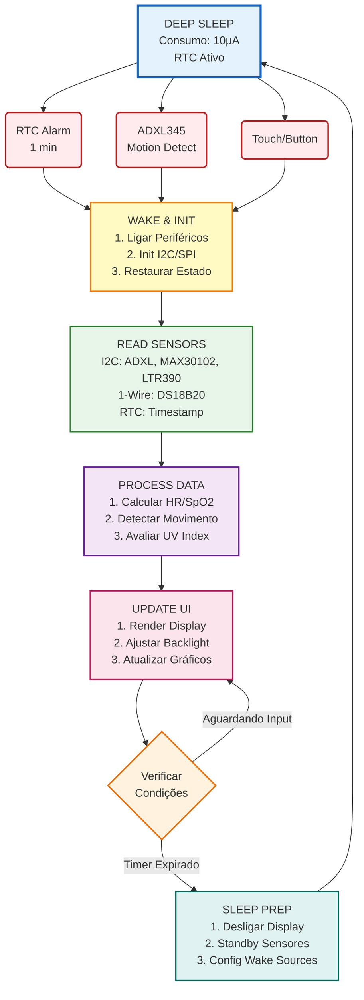

# Justificativa Técnica para Seleção de Componentes

---

## Índice

1. [Microcontrolador: ESP32-C6 (Seeed XIAO)](#1-microcontrolador-esp32-c6-seeed-xiao)

   - [1.1. Justificativa da Escolha](#11-justificativa-da-escolha)
   - [1.2. Alternativas Consideradas](#12-alternativas-consideradas)

2. [Sensoriamento: Análise Individual](#2-sensoriamento-análise-individual)

   - [2.1. DS18B20 - Sensor de Temperatura](#21-ds18b20---sensor-de-temperatura)
   - [2.2. ADXL345 - Acelerômetro Triaxial](#22-adxl345---acelerômetro-triaxial)
   - [2.3. MAX30102 - Sensor de Frequência Cardíaca e SpO2](#23-max30102---sensor-de-frequência-cardíaca-e-spo2)
   - [2.4. LTR390-UV - Sensor de Radiação UV e Luz Ambiente](#24-ltr390-uv---sensor-de-radiação-uv-e-luz-ambiente)

3. [Display: Seeed Round Display](#3-display-seeed-round-display)

   - [3.1. Especificações Presumidas](#31-especificações-presumidas)
   - [3.2. Justificativa da Escolha](#32-justificativa-da-escolha)
   - [3.3. Consumo Energético - Principal Desafio](#33-consumo-energético---principal-desafio)

4. [Alimentação: Arquitetura Crítica](#4-alimentação-arquitetura-crítica)

   - [4.1. Bateria: Li-Po 5000 mAh](#41-bateria-li-po-5000-mah)
   - [4.2. Módulo de Carregamento: TP4056](#42-módulo-de-carregamento-tp4056)
   - [4.3. Regulação de Tensão - REQUISITO OBRIGATÓRIO](#43-regulação-de-tensão---requisito-obrigatório)
   - [4.4. Recomendação Final de Alimentação](#44-recomendação-final-de-alimentação)

5. [Barramento de Comunicação](#5-barramento-de-comunicação)

   - [5.1. Arquitetura de Barramentos](#51-arquitetura-de-barramentos)
   - [5.2. I2C - Análise de Conflitos](#52-i2c---análise-de-conflitos)
   - [5.3. Integridade de Sinais](#53-integridade-de-sinais)

6. [Análise de Consumo Energético](#6-análise-de-consumo-energético)

   - [6.1. Levantamento por Componente](#61-levantamento-por-componente)
   - [6.2. Perfil de Uso - Caso Base](#62-perfil-de-uso---caso-base)
   - [6.3. Estimativa de Autonomia](#63-estimativa-de-autonomia)
   - [6.4. Cenário Realista - Uso como Relógio Ativo](#64-cenário-realista---uso-como-relógio-ativo)
   - [6.5. Estratégias de Otimização](#65-estratégias-de-otimização)

7. [Considerações de Desenvolvimento](#7-considerações-de-desenvolvimento)

   - [7.1. Pilha de Software](#71-pilha-de-software)
   - [7.2. Arquitetura de Firmware](#72-arquitetura-de-firmware)
   - [7.3. Desafios Técnicos Previstos](#73-desafios-técnicos-previstos)
   - [7.4. Validação e Testes](#74-validação-e-testes)

8. [Análise de Custo](#8-análise-de-custo)

   - [8.1. BOM (Bill of Materials)](#81-bom-bill-of-materials)
   - [8.2. Análise Custo-Benefício](#82-análise-custo-benefício)

9. [Riscos e Mitigações](#9-riscos-e-mitigações)

10. [Roadmap de Implementação](#10-roadmap-de-implementação)

11. [Referências Técnicas](#12-referências-técnicas)

**Anexos:**

- [Anexo A: Checklist de Validação Pré-PCB](#anexo-a-checklist-de-validação-pré-pcb)
- [Anexo B: Pinout Proposto ESP32-C6](#anexo-b-pinout-proposto-esp32-c6)

---

## 1. Microcontrolador: ESP32-C6 (Seeed XIAO)

### 1.1. Justificativa da Escolha

**Características Técnicas Relevantes:**

- Arquitetura RISC-V 32-bit @ 160 MHz
- 512 KB SRAM, 4 MB Flash integrado
- Wi-Fi 6 (802.11ax) 2.4 GHz
- Bluetooth 5.3 (LE)
- Periféricos: I2C, SPI, UART, GPIO
- Tensão de operação: 3.0-3.6V
- Form factor XIAO (21x17.5mm)

**Vantagens:**

1. **Compatibilidade Nativa com Display Seeed**

   - Mesma fabricante garante suporte de drivers
   - Footprint XIAO projetado para encaixe direto
   - Documentação e exemplos disponíveis

2. **Conectividade Avançada**

   - Wi-Fi 6 com menor consumo que geração anterior
   - BLE 5.3 permite comunicação eficiente com smartphone
   - Dual-mode possibilita estratégias híbridas de conectividade

3. **Recursos Computacionais Adequados**

   - Processamento de sinais do MAX30102 (algoritmos PPG)
   - Renderização gráfica para display circular
   - Gerenciamento de múltiplos sensores sem gargalo

4. **Ecossistema de Desenvolvimento**
   - Suporte ESP-IDF e Arduino
   - Bibliotecas maduras para todos os sensores selecionados
   - Ferramentas de debugging e profiling disponíveis

**Desvantagens Identificadas:**

1. **Consumo Energético**

   - Wi-Fi ativo: 80-120 mA
   - BLE ativo: 15-20 mA
   - Deep sleep: 7-15 µA
   - **Mitigação:** Estratégia agressiva de power management (detalhada na Seção 7)

2. **Complexidade vs. Requisitos**
   - Recursos de Wi-Fi 6 podem ser overkill para aplicação
   - **Justificativa:** Trade-off entre complexidade e expansibilidade futura (sync em nuvem, OTA updates)

### 1.2. Alternativas Consideradas

| Alternativa | Vantagens                    | Desvantagens                              | Decisão    |
| ----------- | ---------------------------- | ----------------------------------------- | ---------- |
| nRF52840    | Consumo menor, BLE otimizado | Sem Wi-Fi, incompatível com display Seeed | Descartado |
| ESP32-S3    | Dual-core, mais RAM          | Form factor maior, sem Wi-Fi 6            | Descartado |
| STM32L4     | Ultra-low power              | Sem wireless nativo, curva de aprendizado | Descartado |

**Conclusão:** ESP32-C6 oferece o melhor compromisso entre compatibilidade de hardware, recursos de conectividade e viabilidade de desenvolvimento para escopo acadêmico.

---

## 2. Sensoriamento: Análise Individual

### 2.1. DS18B20 - Sensor de Temperatura

**Especificações:**

- Interface: 1-Wire (Dallas/Maxim)
- Faixa: -55°C a +125°C
- Resolução configurável: 9 a 12 bits (0.5°C a 0.0625°C)
- Tensão de operação: 3.0-5.5V
- Consumo: 1.5 mA (ativo), 750 nA (standby)
- Encapsulamento à prova d'água disponível

**Justificativa de Design Mecânico:**

O DS18B20 em formato de sonda (6mm × 30-50mm) oferece vantagens únicas para integração em um dispositivo portátil tipo iDROID (referência: série Metal Gear):

<p align="center">
  
</p>

1. **Conceito de Design: Dispositivo Tático Portátil**

   - Inspiração no iDROID: PDA/comunicador tático dos jogos Metal Gear
   - Display circular central + elementos funcionais externos
   - Estética militar/técnica com componentes visíveis

2. **Integração Como Antena Superior**

   ```
              ┌─ DS18B20 (antena projetada - 30-50mm)
              │
              │
   ┌──────────┴──────────┐
   │                     │
   │   Display Circular  │◄─── Corpo principal
   │      (Round LCD)    │     (estilo iDROID)
   │                     │
   └─────────────────────┘
   ```

   **Características da Montagem:**

   - Sensor fixado no topo do dispositivo
   - Projeção vertical similar a antenas de rádios táticos
   - Formato cilíndrico se integra ao design "tech/militar"
   - Evoca dispositivos de comunicação field-grade

3. **Vantagens Funcionais e Estéticas**

   **a) Isolamento Térmico:**

   - Afastamento de 30-50mm do corpo principal
   - Evita influência do calor do display, bateria e processador
   - Medições de temperatura ambiente verdadeiras (não contaminadas)

   **b) Design Tático:**

   - Elemento visual distintivo (vs. smartphones/smartwatches genéricos)
   - Reforça identidade de dispositivo "field-ready"
   - Remete a equipamento militar/científico portátil
   - Coerente com estética do iDROID (gadget multifuncional)

   **c) Ergonomia:**

   - Antena no topo não interfere com grip/manuseio
   - Posicionamento permite exposição ao ambiente durante uso
   - Facilita leituras precisas sem bloquear sensor com a mão

4. **Implementação Física**

   **Materiais e Acabamento:**

   - Tubo de aço inox fosco ou alumínio anodizado (militar gray/black)
   - Acabamento anti-reflexo (coerente com equipamento tático)
   - Opcional: Marcações laser com especificações técnicas

   **Fixação Mecânica:**

   - Montagem rosqueada M6 na face superior do case
   - O-ring de vedação para manter rating IP67/IP68
   - Permite substituição/manutenção sem desmontar dispositivo

   **Conexão Elétrica:**

   - Cabo interno de 3 vias (VCC, GND, DATA) - 50-80mm
   - Roteamento por canal interno do case
   - Conector JST-SH ou similar para modularidade

5. **Referências de Design**

   - **iDROID (MGS4/MGSV):** Display multifuncional + elementos táticos
   - **Rádios militares (AN/PRC):** Antena destacada no topo
   - **Equipamentos de campo:** Sensores externos para precisão
   - **Sci-fi tactical gear:** Funcionalidade exposta como elemento estético

**Justificativa Técnica:**

1. **Adequação à Aplicação**

   - Medição de temperatura ambiente ou corporal superficial
   - Precisão de ±0.5°C atende requisitos de monitoramento não-médico
   - Versão impermeável agrega robustez

2. **Configuração de Resolução Otimizada**

   O DS18B20 permite configuração de resolução entre 9 e 12 bits, com trade-off direto entre precisão e tempo de conversão:

   | Resolução | Precisão  | Tempo de Conversão | Consumo de Energia |
   | --------- | --------- | ------------------ | ------------------ |
   | 9 bits    | ±0.5°C    | 93.75 ms           | Menor              |
   | 10 bits   | ±0.25°C   | 187.5 ms           | Baixo              |
   | 11 bits   | ±0.125°C  | 375 ms             | Médio              |
   | 12 bits   | ±0.0625°C | 750 ms             | Maior              |

   **Escolha: Resolução de 9 bits**

   **Justificativa:**

   - Aplicação focada em **temperatura ambiente** (não termometria clínica)
   - Precisão de ±0.5°C é **mais que suficiente** para:
     - Conforto térmico (diferenças perceptíveis ≥2°C)
     - Alertas ambientais (calor/frio excessivo)
     - Registro de condições de campo
   - **Vantagens de desempenho:**
     - Tempo de conversão **8× mais rápido** (93.75ms vs 750ms)
     - Menor consumo energético por medição
     - Permite leituras mais frequentes sem impactar bateria
     - Reduz tempo de wake do ESP32 (melhor para deep sleep)
   - **Impacto na autonomia:**
     ```
     Conversão 12 bits: 750ms @ 1.5mA = 1.125 mJ
     Conversão 9 bits:  93.75ms @ 1.5mA = 0.141 mJ
     Economia: 87.5% de energia por leitura
     ```

   **Implementação:**

   ```c
   // Configurar DS18B20 para 9 bits
   sensor.setResolution(9);  // Biblioteca DallasTemperature
   // Resultado: conversão em ~94ms com ±0.5°C
   ```

3. **Vantagens de Integração**

   - Protocolo 1-Wire libera barramento I2C para outros sensores
   - Requer apenas 1 GPIO + GND + VCC
   - Múltiplos sensores no mesmo barramento (expansibilidade)
   - Biblioteca OneWire madura para ESP32

4. **Circuitaria Externa**

   ```
   Requisito obrigatório:
   - Resistor pull-up 4.7kΩ entre DATA e VCC
   - Capacitor 100nF próximo ao sensor (filtro de ruído)
   ```

5. **Custo-Benefício**
   - R$ 13,06 (versão à prova d'água)
   - Relação desempenho/custo excelente para aplicação

**Limitações:**

- Tempo de conversão: 750ms (12 bits) - requer leitura não-bloqueante
- Não adequado para medição de temperatura corporal core (termômetro clínico)

### 2.2. ADXL345 - Acelerômetro Triaxial

**Especificações:**

- Interface: I2C (até 400 kHz) ou SPI (até 5 MHz)
- Faixa: ±2g, ±4g, ±8g, ±16g (configurável)
- Resolução: 13 bits (até 4 mg/LSB)
- Tensão: 2.0-3.6V
- Consumo: 40 µA @ 2.5V (modo medição 100 Hz)
- FIFO buffer: 32 níveis

**Justificativa Técnica:**

1. **Aplicações no Projeto**

   - Detecção de movimento (activity recognition)
   - Detecção de queda (fall detection)
   - Contagem de passos (pedômetro)
   - Análise de padrões de sono (inatividade prolongada)

2. **Vantagens Arquiteturais**

   - FIFO buffer reduz carga de processamento (batch reading)
   - Interrupções configuráveis para eventos (tap, free fall, inactivity)
   - Modo low power preserva bateria sem perder funcionalidade

3. **Consumo Otimizado**
   - Taxa de amostragem configurável (0.1 Hz a 3200 Hz)
   - Para relógio: 10-50 Hz suficiente (consumo <50 µA)

**Alternativas Consideradas:**

- MPU6050 (giroscópio integrado): Descartado por consumo maior e complexidade desnecessária
- LIS3DH (ST): Consumo similar, menor disponibilidade de documentação

### 2.3. MAX30102 - Sensor de Frequência Cardíaca e SpO2

**Especificações:**

- Interface: I2C (até 400 kHz)
- Princípio: Fotopletismografia (PPG) com LEDs vermelho (660nm) e infravermelho (880nm)
- Tensão: 1.8V (core) + 3.3-5.0V (LEDs) - módulos comerciais integram regulação
- Consumo: 600 µA (típico) + picos de até 50 mA (LEDs)
- Resolução ADC: 18 bits
- FIFO: 32 samples x 4 bytes

**Justificativa Técnica:**

1. **Relevância Biométrica**

   - Frequência cardíaca: parâmetro vital primário
   - SpO2: indicador de oxigenação sanguínea (saúde cardiovascular)
   - Aplicações: fitness tracking, detecção de arritmias, monitoramento de estresse

2. **Desafios de Integração**

   **a) Consumo Energético:**

   ```
   Estratégia de mitigação:
   - Medições intermitentes (não contínuas)
   - Ex: 10 segundos de aquisição a cada 5 minutos
   - Desabilitar sensor entre medições (economia >95%)
   - Usar interrupções para acordar ESP32 apenas quando necessário
   ```

   **b) Integridade do Sinal:**

   ```
   Requisitos de hardware:
   - Filtro LC na alimentação dos LEDs (100µH + 10µF)
   - Capacitor cerâmico 100nF + 1µF na linha VCC do sensor
   - Ground plane contínuo sob o sensor
   - Traces curtos entre sensor e MCU (I2C <10cm)
   ```

   **c) Posicionamento Físico:**

   ```
   Critérios para relógio de bolso:
   - Sensor na face posterior (contato com pele)
   - Pressão uniforme (anel de silicone/espuma)
   - Proteção contra luz ambiente (vedação óptica)
   ```

3. **Processamento de Dados**

   - Algoritmos de detecção de batimentos (peak detection)
   - Filtragem digital de motion artifacts
   - Cálculo de SpO2 via ratio-of-ratios (R value)
   - **Carga Computacional:** ~5-10% do tempo de CPU @ 50 Hz

4. **Limitações e Advertências**
   - Não é dispositivo médico certificado (uso recreativo/educacional)
   - Sensibilidade a movimento (requer algoritmos de compensação)
   - Calibração individual pode ser necessária

**Custo:** R$ 17,56 - justificável pela funcionalidade dual (HR + SpO2)

### 2.4. LTR390-UV - Sensor de Radiação UV e Luz Ambiente

**Especificações:**

- Interface: I2C (endereço fixo 0x53)
- Canais: UVS (ultravioleta) e ALS (luz ambiente)
- Faixa dinâmica: 18 bits (0.01 a 188k lux)
- Tensão: 1.7-3.6V
- Consumo: 120 µA (ativo), 0.5 µA (standby)
- Tempo de conversão: 100-500 ms (configurável)

**Justificativa Técnica:**

1. **Aplicabilidade**

   - Índice UV: alerta de exposição solar (prevenção de queimaduras/câncer de pele)
   - Luz ambiente: ajuste automático de brilho do display
   - Dados complementares para análise de atividades outdoor

2. **Diferencial do LTR390**

   - Sensibilidade UV verdadeira (não inferida por ratio)
   - Filtro UV integrado (280-320 nm)
   - Compensação de temperatura interna

3. **Conflito de Endereço I2C**

   ```
   Problema: LTR390 (0x53) = ADXL345 (padrão 0x53)

   Solução implementada:
   - ADXL345 configurado para 0x1D (SDO = VCC)
   - LTR390 permanece em 0x53
   - Validação: scan I2C deve mostrar ambos endereços distintos
   ```

4. **Estratégia de Leitura**
   - Polling a cada 30-60 segundos (não crítico)
   - Modo standby entre leituras
   - Impacto na bateria: desprezível (<1%)

**Custo:** R$ 36,04 - mais caro, mas único sensor UV digital acessível no mercado brasileiro

---

## 3. Display: Seeed Round Display

### 3.1. Especificações Presumidas

(Baseado em displays circulares Seeed típicos para XIAO)

- Diagonal: 1.28" - 1.69" (TFT circular)
- Resolução: 240x240 ou 240x280 pixels
- Interface: SPI (4-wire)
- Controller: GC9A01 ou similar
- Backlight: LEDs brancos com controle PWM
- Touchscreen: Capacitivo

### 3.2. Justificativa da Escolha

1. **Integração Mecânica**

   - Form factor projetado para XIAO (plug-and-play)
   - Reduz complexidade de montagem e fiação

2. **Interface Humano-Máquina**

   - Display gráfico permite visualização rica de dados
   - Formato circular ideal para relógio (estética)

3. **Chip RTC Integrado - Vantagem Crítica**

   O Seeed Round Display incorpora um módulo RTC (Real-Time Clock) integrado, componente essencial para a arquitetura de baixo consumo do projeto:

   **Vantagens Arquiteturais:**

   - **Timekeeping Independente:** Mantém hora precisa sem depender do ESP32
   - **Deep Sleep Otimizado:** ESP32 pode entrar em deep sleep sem perder sincronização temporal
   - **Backup de Energia:** Suporte para bateria coin cell CR2032 (consumo <1 µA)
   - **Redução de Consumo:** ESP32 acorda apenas para atualizar display, não para manter hora
   - **Alarmes Programáveis:** Gera interrupções para wake-up agendado

   **Integração com Power Management:**

   ```
   Cenário Operacional:
   1. RTC mantém hora em tempo real (consumo <1 µA)
   2. RTC gera alarme a cada minuto (interrupção para ESP32)
   3. ESP32 acorda, lê RTC via I2C (~10ms)
   4. ESP32 atualiza display e volta a deep sleep
   5. Ciclo: RTC nunca para, ESP32 ativo <1% do tempo

   Economia energética vs. RTC por software:
   - Com RTC: ESP32 em deep sleep 99% do tempo (10 µA)
   - Sem RTC: ESP32 deve acordar periodicamente (consumo 100× maior)
   ```

   **Impacto na Autonomia:**

   A presença do RTC integrado é um dos principais facilitadores para atingir a meta de autonomia de 3 meses, eliminando a necessidade de manter o ESP32 ativo para contagem de tempo.

### 3.3. Consumo Energético

**Análise de Consumo:**

```
Backlight típico: 20-80 mA (depende do brilho)
Controller + LCD: 5-15 mA
Total: 25-95 mA quando tela ativa

Impacto na bateria 5000 mAh:
- Tela 100% brilho contínuo: ~50-60 horas
- Tela 50% brilho contínuo: ~100-120 horas
- Modo relógio (refresh 1 Hz, brilho baixo): ~400-500 horas
```

**Estratégias de Mitigação:**

1. **Controle de Brilho Adaptativo**

   ```c
   // Pseudocódigo
   if (ltr390.lux > 10000) backlight_pwm = 80%;  // Sol direto
   else if (ltr390.lux > 1000) backlight_pwm = 50%;  // Ambientes claros
   else if (ltr390.lux > 100) backlight_pwm = 20%;   // Ambientes normais
   else backlight_pwm = 5%;                          // Escuro
   ```

2. **Gesture Wake-Up**

   ```c
   // ADXL345 detecta movimento de levantar punho
   // Interrupção acorda ESP32 -> liga display por 5-10s -> volta a sleep
   ```

3. **Display Blanking**

   - Desligar backlight completamente após timeout
   - Manter apenas RTC ativo (consumo <10 µA)

4. **Partial Refresh**
   - Atualizar apenas áreas alteradas (hora vs. sensores)
   - Reduz tempo de SPI ativo

---

## 4. Alimentação

### 4.1. Bateria: Li-Po 5000 mAh

**Especificações Típicas:**

- Química: Lithium Polymer (LiPo)
- Tensão nominal: 3.7V
- Faixa de operação: 3.0V (vazio) - 4.2V (cheio)
- Taxa de descarga: 1C (5A) - suficiente para aplicação

**Justificativa:**

- Densidade energética alta (~150-200 Wh/kg)
- Form factor flexível (pouch cell)
- Custo acessível
- Disponibilidade comercial

**Limitações:**

- Requer proteção contra sobrecarga, descarga profunda e curto-circuito
- Degrada com ciclos (300-500 ciclos até 80% capacidade)

### 4.2. Módulo de Carregamento: TP4056

**Especificações:**

- Corrente de carga: até 1A (configurável por resistor)
- Tensão de carga: 4.2V ± 1%
- Entrada: 5V (micro-USB típico)
- Proteção: Térmica integrada

**Vantagens:**

- Baixo custo (R$ 3-8)
- Amplamente disponível
- Simplicidade de uso

**LIMITAÇÕES CRÍTICAS:**

1. **Ausência de Boost/Buck Converter**

   ```
   Problema:
   TP4056 apenas carrega bateria e fornece Vbat na saída
   Vbat varia de 4.2V (cheio) a 3.0V (vazio)

   ESP32-C6 especificação: 3.0-3.6V
   Display e sensores: 3.3V ± 5%

   Consequências de não regular:
   - Em 4.2V: DESTRUIÇÃO de sensores e ESP32 (overvoltage)
   - Em 3.0-3.2V: Operação instável, brownouts, corrupção de dados
   ```

2. **Ausência de Proteção de Bateria**

   ```
   TP4056 padrão NÃO tem:
   - Proteção contra descarga profunda (<3.0V)
   - Proteção contra sobrecorrente
   - Proteção contra curto-circuito

   SOLUÇÃO OBRIGATÓRIA:
   Usar módulo TP4056 com DW01A + FS8205A (proteção integrada)
   OU adicionar BMS externo (Battery Management System)
   ```

### 4.3. Regulação de Tensão - SUGESTÃO

**Opções de Arquitetura:**

#### Opção A: Regulador LDO (Low Dropout)

**Componente Recomendado:** AP2112K-3.3 ou AMS1117-3.3

**Vantagens:**

- Simplicidade (3 componentes: LDO + 2 capacitores)
- Baixo ruído (importante para MAX30102)
- Custo baixo (R$ 2-5)

**Desvantagens:**

- Eficiência baixa quando Vbat >> 3.3V
  ```
  Eficiência = Vout/Vin = 3.3V/4.2V = 78.5% (início)
  Eficiência = 3.3V/3.6V = 91.6% (meio)
  Dropout: ~0.3V → funciona até Vbat = 3.6V
  ```
- Perde ~20% de energia como calor (4.2V → 3.3V)

**Cálculo de Dissipação:**

```
Corrente pico (display + Wi-Fi): ~180 mA
Pdiss = (Vin - Vout) × I = (4.2 - 3.3) × 0.18 = 162 mW
```

- Gerenciável com LDO em SOT-23 (sem dissipador)

#### Opção B: Buck Converter (Step-Down Comutado)

**Componente Recomendado:** TPS62130 ou XC6220

**Vantagens:**

- Eficiência alta (85-95%) em toda faixa
- Aproveita melhor capacidade da bateria
- Autonomia ~15-20% maior

**Desvantagens:**

- Ruído de chaveamento (requer filtragem cuidadosa)
- Maior complexidade (indutor, diodo Schottky, caps)
- Custo maior (R$ 8-15)

**Cálculo de Eficiência:**

```
Bateria → Buck 90% → Carga 3.3V
Energia útil = 5000 mAh × 3.7V × 0.9 / 3.3V = 5045 mAh efetivos @ 3.3V

Bateria → LDO 85% → Carga 3.3V
Energia útil = 5000 mAh × 3.7V × 0.85 / 3.3V = 4773 mAh efetivos @ 3.3V

Ganho: +272 mAh (~5-6 horas de operação)
```

### 4.4. Recomendação Final de Alimentação

**Para TCC (Balanceamento Custo/Desempenho/Complexidade):**

```
Arquitetura Proposta:
┌──────────────┐
│  Li-Po 5000  │ 3.0-4.2V
│     mAh      │
└──────┬───────┘
       │
┌──────▼───────────┐
│  TP4056 + DW01A  │ Carregamento + Proteção
└──────┬───────────┘
       │ Vbat
┌──────▼───────────┐
│  AP2112K-3.3 LDO │ Regulação para 3.3V
└──────┬───────────┘
       │ 3.3V
       ├──► ESP32-C6
       ├──► Display
       ├──► MAX30102
       ├──► ADXL345 (via level shift se necessário)
       ├──► LTR390
       └──► DS18B20
```

**Justificativa:**

1. Simplicidade de implementação (acadêmico)
2. Custo total ~R$ 10
3. Ruído aceitável com boa PCB layout
4. Confiabilidade comprovada

---

## 5. Barramento de Comunicação

### 5.1. Arquitetura de Barramentos

```
┌─────────────────────────────────────────────────────────┐
│                      ESP32-C6                           │
│                                                         │
│  GPIO_X (1-Wire) ──────────────────────► DS18B20        │
│                         (+ pull-up 4.7kΩ)               │
│                                                         │
│  GPIO_SDA (I2C) ─┬──────────────────────► MAX30102      │
│  GPIO_SCL (I2C) ─┤                        (0x57)        │
│                  ├──────────────────────► ADXL345       │
│                  │                        (0x1D)        │
│                  └──────────────────────► LTR390        │
│                                           (0x53)        │
│                                                         │
│  GPIO_MOSI (SPI) ────┐                                  │
│  GPIO_MISO (SPI) ────┤                                  │
│  GPIO_SCK  (SPI) ────┼──────────────────► Display       │
│  GPIO_CS   (SPI) ────┤                    Redondo       │
│  GPIO_DC         ────┤                                  │
│  GPIO_RST        ────┘                                  │
│                                                         │
└─────────────────────────────────────────────────────────┘
```

### 5.2. I2C - Análise de Conflitos

**Endereços Configurados:**
| Dispositivo | Endereço | Conflito | Solução |
|-------------|----------|----------|-----------|
| MAX30102 | 0x57 | Nenhum | Padrão |
| LTR390-UV | 0x53 | ADXL345 | ADXL→0x1D |
| ADXL345 | 0x1D | Nenhum | SDO=VCC |

**Validação de Endereços:**

```c
// Código de validação I2C obrigatório no setup()
void i2c_scan() {
    Serial.println("Scanning I2C bus...");
    for(uint8_t addr = 1; addr < 127; addr++) {
        Wire.beginTransmission(addr);
        if (Wire.endTransmission() == 0) {
            Serial.printf("Device found at 0x%02X\n", addr);
        }
    }
}

// Saída esperada:
// Device found at 0x1D  (ADXL345)
// Device found at 0x53  (LTR390)
// Device found at 0x57  (MAX30102)
```

### 5.3. Integridade de Sinais

**Pull-ups I2C:**

```
Cálculo de resistor:
Rp = (Vcc - Vil) / Iol

Com 3 dispositivos @ 400 kHz:
- Capacitância de linha: ~30 pF/dispositivo + 50 pF/trace = ~150 pF
- Tempo de subida desejado: <300 ns (spec I2C fast mode)

Rp_min = tr / (0.8473 × C) = 300ns / (0.8473 × 150pF) = 2.36 kΩ
Rp_max = Vcc / (3 mA × n_devices) = 3.3V / 9mA = 367 Ω

Valor comercial recomendado: 2.2 kΩ (margem de segurança)
```

**Importante:** ESP32 possui pull-ups internos fracos (~45 kΩ). Adicionar pull-ups externos de 2.2 kΩ é OBRIGATÓRIO para operação confiável a 400 kHz.

---

## 6. Análise de Consumo Energético

### 6.1. Levantamento por Componente

| Componente           | Ativo    | Sleep/Standby | Notas                       |
| -------------------- | -------- | ------------- | --------------------------- |
| ESP32-C6 Wi-Fi ON    | 110 mA   | -             | Insustentável               |
| ESP32-C6 BLE ON      | 18 mA    | -             | Viável para períodos curtos |
| ESP32-C6 Deep Sleep  | -        | 10 µA         | Estado padrão               |
| Display (50% brilho) | 40 mA    | 0 mA          | Backlight PWM               |
| MAX30102 (medição)   | 30 mA    | 0.7 µA        | Picos de LED                |
| ADXL345              | 0.14 mA  | 0.1 µA        | @100Hz, low-power           |
| LTR390-UV            | 0.12 mA  | 0.5 µA        | Polling mode                |
| DS18B20              | 1.5 mA   | 0.75 µA       | Durante conversão           |
| LDO Quiescent        | 0.055 mA | 0.055 mA      | AP2112K                     |

### 6.2. Perfil de Uso - Caso Base

**Cenário: Relógio com medições periódicas**

```
Ciclo de 1 hora (3600 segundos):

1. Deep Sleep (3540s):
   - ESP32: 10 µA
   - Sensores: ~2 µA
   - Display OFF: 0 mA
   - Total: 12 µA × 3540s = 11.8 mAh/h = 0.012 mAh

2. Wake + Sensor Reading (10s):
   - ESP32 ativo: 20 mA
   - Todos sensores: 32 mA
   - Display OFF: 0 mA
   - Total: 52 mA × 10s = 0.144 mAh

3. Display Update (30s):
   - ESP32: 25 mA
   - Display (20% brilho): 25 mA
   - Sensores standby: 2 µA
   - Total: 50 mA × 30s = 0.417 mAh

4. Medição HR (10s a cada hora):
   - ESP32: 25 mA
   - MAX30102: 30 mA
   - Display: 25 mA
   - Total: 80 mA × 10s = 0.222 mAh

5. Sync BLE (20s a cada 6 horas → 3.33s/hora):
   - ESP32 BLE: 18 mA
   - Display: 25 mA
   - Total: 43 mA × 3.33s = 0.040 mAh

CONSUMO MÉDIO POR HORA = 0.012 + 0.144 + 0.417 + 0.222 + 0.040 = 0.835 mAh/h
```

### 6.3. Estimativa de Autonomia

**Bateria: 5000 mAh @ 3.7V**

```
Capacidade efetiva @ 3.3V (LDO 85%):
C_eff = 5000 × (3.7/3.3) × 0.85 = 4773 mAh

Autonomia = 4773 mAh / 0.835 mAh/h = 5716 horas = 238 dias
```

**ATENÇÃO:** Este cálculo assume:

- 95% do tempo em deep sleep
- Display ligado apenas 30s por hora
- Sem uso de Wi-Fi

### 6.4. Cenário Realista - Uso como Relógio Ativo

```
Premissas:
- Usuário olha relógio 50x/dia (5s cada) = 250s display ON
- Medição HR: 10x/dia (10s cada) = 100s
- Leituras ambientais contínuas em background
- Sync BLE 4x/dia (30s cada) = 120s

Cálculo diário:
1. Deep Sleep (86400 - 470s = 85930s):
   12 µA × 85930s / 3600 = 0.286 mAh

2. Display ON (250s):
   50 mA × 250s / 3600 = 3.47 mAh

3. HR Readings (100s):
   80 mA × 100s / 3600 = 2.22 mAh

4. BLE Sync (120s):
   43 mA × 120s / 3600 = 1.43 mAh

5. Sensores background (contínuo):
   2 mA × 86400s / 3600 = 48 mAh

CONSUMO DIÁRIO = 0.29 + 3.47 + 2.22 + 1.43 + 48 = 55.4 mAh/dia

AUTONOMIA REAL = 4773 mAh / 55.4 mAh/dia = 86 dias
```

**Conclusão:** Com uso moderado e otimizações de software, autonomia de ~3 meses é viável.

### 6.5. Estratégias de Otimização

**Nível 1 - Firmware (Implementação Obrigatória):**

1. Deep Sleep agressivo (wake on interrupt)
2. Clock gating (desabilitar periféricos não usados)
3. Dynamic Frequency Scaling (reduzir clock para tarefas simples)
4. Minimizar tempo de boot (skip Wi-Fi init se não necessário)

**Nível 2 - Sensores:**

1. Desabilitar completamente MAX30102 entre medições (I2C shutdown command)
2. ADXL345 em modo low-power (12.5 Hz suficiente para detecção de movimento)
3. LTR390 em modo one-shot (vs. continuous)

**Nível 3 - Display:**

1. E-Ink como alternativa futura (consumo ~0 em repouso)
2. Motion-activated wake (ADXL345 interrupt → GPIO wake ESP32)
3. OLED parcial (atualizar apenas dígitos alterados)

**Nível 4 - Conectividade:**

1. EVITAR Wi-Fi contínuo (use apenas para sync programado via NTP)
2. BLE advertising em intervalos longos (1000 ms vs. 100 ms padrão)
3. Conexão sob demanda (não permanente)

---

## 7. Considerações de Desenvolvimento

### 7.1. Pilha de Software

**Sistema Operacional:**

- ESP-IDF
- FreeRTOS para gerenciamento de tarefas

**Bibliotecas Necessárias:**

```
DS18B20:      OneWire + DallasTemperature
ADXL345:      Adafruit_ADXL345 ou SparkFun
MAX30102:     SparkFun_MAX3010x ou bibliotecas com algoritmos PPG
LTR390:       Adafruit_LTR390 ou DFRobot_LTR390UV
Display:      TFT_eSPI (configurado para GC9A01)
RTC:          RTClib ou driver específico do chip do display
Power Mgmt:   ESP32 Deep Sleep API
```

### 7.2. Arquitetura de Firmware

**Diagrama de Estados:**



### 7.3. Desafios Técnicos Previstos

1. **Algoritmos PPG (MAX30102)**

   - Complexidade: Alta
   - Solução: Usar bibliotecas validadas, validar com oxímetro comercial

2. **Sincronização RTC**

   - Drift típico: 1-10 ppm (±1-10s/dia)
   - Solução: Sync NTP semanal via Wi-Fi

3. **Detecção de Movimento (ADXL345)**

   - False positives em vibração
   - Solução: Filtro passa-baixa + threshold adaptativo

4. **Layout de PCB**
   - Isolamento analógico/digital crítico
   - Solução: Ground planes separados, stitching vias, filtros LC

### 7.4. Validação e Testes

**Protocolo de Testes Obrigatórios:**

1. **Consumo Energético**

   - Instrumentar com amperímetro de precisão (µA range)
   - Validar cada modo de operação
   - Meta: <100 µA em deep sleep

2. **Precisão de Sensores**

   - DS18B20: Comparar com termômetro calibrado (±0.5°C)
   - ADXL345: Teste de orientação (1g nos 3 eixos)
   - MAX30102: Validação com dispositivo médico
   - LTR390: Comparação com medidor UV comercial

3. **Robustez**

   - Teste de bateria (ciclo completo 100% → 0%)
   - Brownout recovery (desconectar bateria em operação)
   - I2C bus recovery (slave hang)

4. **Autonomia Real**
   - Ciclo de uso simulado por 7 dias
   - Medição de consumo acumulado vs. estimativa

---

## 8. Análise de Custo

### 8.1. BOM (Bill of Materials)

| Item | Descrição                   | Qtd | Preço Unit. | Total         |
| ---- | --------------------------- | --- | ----------- | ------------- |
| 1    | ESP32-C6 XIAO               | 1   | R$ 65,00    | R$ 65,00      |
| 2    | Display Redondo Seeed       | 1   | R$ 120,00   | R$ 120,00     |
| 3    | DS18B20 (waterproof)        | 1   | R$ 13,06    | R$ 13,06      |
| 4    | ADXL345                     | 1   | R$ 20,00    | R$ 20,00      |
| 5    | MAX30102                    | 1   | R$ 17,56    | R$ 17,56      |
| 6    | LTR390-UV                   | 1   | R$ 36,04    | R$ 36,04      |
| 7    | Bateria LiPo 5000mAh        | 1   | R$ 45,00    | R$ 45,00      |
| 8    | TP4056 + Proteção           | 1   | R$ 8,00     | R$ 8,00       |
| 9    | LDO AP2112K-3.3             | 1   | R$ 4,00     | R$ 4,00       |
| 10   | Resistores, Caps, Conectors | -   | R$ 20,00    | R$ 20,00      |
| 11   | PCB Customizado             | 1   | R$ 30,00    | R$ 30,00      |
| 12   | Case / Enclosure            | 1   | R$ 40,00    | R$ 40,00      |
|      |                             |     | **TOTAL**   | **R$ 418,66** |

### 8.2. Análise Custo-Benefício

**Comparativo com Smartwatches Comerciais:**

- Xiaomi Mi Band 8: R$ 250-300 (sem UV, sem temp)
- Garmin Vivosmart 5: R$ 800-1000 (sem UV)
- Projeto TCC: R$ 419 (customizável, educacional)

**Valor Acadêmico:**

- Integração de múltiplos protocolos (I2C, SPI, 1-Wire)
- Projeto de sistema de baixo consumo
- Firmware embarcado complexo
- Justifica investimento para TCC

---

## 9. Riscos e Mitigações

| Risco                       | Probabilidade | Impacto | Mitigação                                                    |
| --------------------------- | ------------- | ------- | ------------------------------------------------------------ |
| Consumo acima do estimado   | Média         | Alto    | Profiling de consumo antecipado, bateria modular             |
| Interferência I2C           | Baixa         | Médio   | Scan de barramento, traces curtos, pull-ups adequados        |
| Leituras MAX30102 instáveis | Alta          | Alto    | Alimentação filtrada, algoritmos robustos, testes extensivos |
| Autonomia insuficiente      | Média         | Médio   | Bateria maior (upgrade para 10000mAh viável)                 |
| Display incompatível        | Baixa         | Alto    | Validação prévia com datasheet e exemplos Seeed              |
| Drift de RTC                | Baixa         | Baixo   | Sincronização NTP periódica                                  |
| Sobrecarga de 3.3V          | Média         | Crítico | Proteção por fusível resetável (PPTC 500mA)                  |

---

## 10. Roadmap de Implementação

### Fase 1: Prototipagem em Breadboard (2-3 semanas)

- [ ] Validar cada sensor individualmente
- [ ] Testar barramento I2C completo
- [ ] Implementar drivers básicos
- [ ] Medições de consumo preliminares

### Fase 2: Desenvolvimento de Firmware (4-6 semanas)

- [ ] Arquitetura de tasks (FreeRTOS)
- [ ] State machine de power management
- [ ] Integração com display e RTC
- [ ] Algoritmos de processamento (PPG, motion)
- [ ] Interface gráfica

### Fase 3: Design de PCB (2-3 semanas)

- [ ] Schematic design (KiCad/Altium)
- [ ] Layout (atenção a EMI/EMC)
- [ ] Fabricação (JLCPCB/PCBWay)
- [ ] Montagem SMD

### Fase 4: Integração e Testes (3-4 semanas)

- [ ] Testes funcionais
- [ ] Validação de autonomia
- [ ] Calibração de sensores
- [ ] Testes de campo

### Fase 5: Documentação (2 semanas)

- [ ] Manual técnico
- [ ] Artigo/Monografia
- [ ] Apresentação

**Total Estimado:** 13-18 semanas

---

## 11. Referências Técnicas

Adicionar os datasheets usados depois!!!

### Datasheets

1. ESP32-C6 Technical Reference Manual - Espressif Systems
2. DS18B20 Programmable Resolution 1-Wire Digital Thermometer - Maxim Integrated
3. ADXL345 Digital Accelerometer - Analog Devices
4. MAX30102 High-Sensitivity Pulse Oximeter and Heart-Rate Sensor - Maxim Integrated
5. LTR-390UV-01 UV Light Sensor - Lite-On
6. TP4056 1A Standalone Linear Li-Ion Battery Charger - NanJing Top Power ASIC
7. AP2112 600mA CMOS LDO Regulator - Diodes Incorporated

### Application Notes

1. AN4365: Using ESP32 ULP Coprocessor for Low Power - Espressif
2. AN6409: Designing with MAX30102 - Maxim Integrated
3. AN1077: Best Practices for I2C - NXP Semiconductors
4. AN-1112: Lithium Battery Charger Design - TI

### Standards e Normativas

1. I2C-bus specification v6 - NXP (UM10204)
2. ISO 80601-2-61: Pulse oximeters - medical electrical equipment
3. IEC 62368-1: Safety of wearable electronic equipment

---

## Anexo A: Checklist de Validação Pré-PCB

- [ ] Scan I2C mostra 3 endereços distintos (0x1D, 0x53, 0x57)
- [ ] DS18B20 retorna temperatura válida (<1 segundo)
- [ ] ADXL345 detecta orientação (±1g em cada eixo)
- [ ] MAX30102 gera sinal PPG com dedo posicionado
- [ ] LTR390 responde a variação de luz (LED vs. escuro)
- [ ] Display renderiza gráficos sem flicker
- [ ] RTC mantém hora por >24h sem reset
- [ ] Consumo em deep sleep < 50 µA (medido com multímetro)
- [ ] Bateria carrega de 3.0V → 4.2V em <5 horas
- [ ] LDO mantém 3.3V ±3% com Vbat de 3.3V a 4.2V

---

## Anexo B: Pinout Proposto ESP32-C6

| Pino   | Função        | Dispositivo       | Notas                 |
| ------ | ------------- | ----------------- | --------------------- |
| GPIO0  | I2C SDA       | Sensores I2C      | Pull-up 2.2kΩ externo |
| GPIO1  | I2C SCL       | Sensores I2C      | Pull-up 2.2kΩ externo |
| GPIO2  | 1-Wire Data   | DS18B20           | Pull-up 4.7kΩ externo |
| GPIO3  | SPI MOSI      | Display           | -                     |
| GPIO4  | SPI MISO      | Display           | -                     |
| GPIO5  | SPI SCK       | Display           | -                     |
| GPIO6  | SPI CS        | Display           | -                     |
| GPIO7  | Display DC    | Display           | -                     |
| GPIO8  | Display RST   | Display           | -                     |
| GPIO9  | Backlight PWM | Display           | LEDC channel 0        |
| GPIO10 | Interrupt     | ADXL345           | Wake source           |
| GPIO18 | Battery ADC   | Divisor de tensão | ADC1_CH0              |

**Nota:** Confirmar com schematic do Seeed Round Display - alguns pinos podem estar pré-alocados.

---
