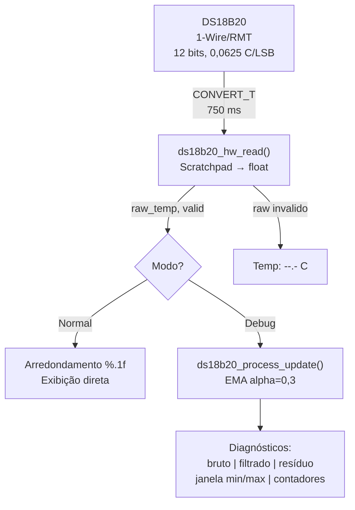

# Capítulo: Temperatura Ambiente com Sensor DS18B20, Protocolo 1-Wire e Periférico RMT

---

## Índice

1. [Introdução e Contexto no Projeto](#1-introdução-e-contexto-no-projeto)

2. [Fundamentação Teórica](#2-fundamentação-teórica)

   - [2.1. Medição de Temperatura por Sensor Digital](#21-medição-de-temperatura-por-sensor-digital)
   - [2.2. Conversão Delta-Sigma e Resolução](#22-conversão-delta-sigma-e-resolução)
   - [2.3. Protocolo 1-Wire](#23-protocolo-1-wire)
   - [2.4. Ruído de Quantização e Filtragem](#24-ruído-de-quantização-e-filtragem)

3. [Hardware: Sensor DS18B20](#3-hardware-sensor-ds18b20)

   - [3.1. Arquitetura Interna](#31-arquitetura-interna)
   - [3.2. Especificações Elétricas](#32-especificações-elétricas)
   - [3.3. Scratchpad e Formato dos Dados](#33-scratchpad-e-formato-dos-dados)
   - [3.4. Resoluções Configuráveis e Tempo de Conversão](#34-resoluções-configuráveis-e-tempo-de-conversão)
   - [3.5. Conexão Física com o ESP32-C6](#35-conexão-física-com-o-esp32-c6)

4. [Comunicação 1-Wire via Periférico RMT](#4-comunicação-1-wire-via-periférico-rmt)

   - [4.1. Por que RMT e Não Bit-Banging](#41-por-que-rmt-e-nao-bit-banging)
   - [4.2. Componentes Gerenciados ESP-IDF](#42-componentes-gerenciados-esp-idf)
   - [4.3. Sequência de Inicialização](#43-sequência-de-inicialização)
   - [4.4. Ciclo de Leitura](#44-ciclo-de-leitura)

5. [Pipeline de Processamento](#5-pipeline-de-processamento)

   - [5.1. Visão Geral da Arquitetura](#51-visão-geral-da-arquitetura)
   - [5.2. Modo Normal: Saída Direta](#52-modo-normal-saida-direta)
   - [5.3. Modo Debug: Filtragem EMA e Diagnósticos](#53-modo-debug-filtragem-ema-e-diagnósticos)
   - [5.4. Diagrama do Pipeline](#54-diagrama-do-pipeline)

6. [Estrutura do Firmware](#6-estrutura-do-firmware)

   - [6.1. Organização Modular](#61-organização-modular)
   - [6.2. Detalhamento dos Módulos](#62-detalhamento-dos-módulos)

7. [Resultados Experimentais](#7-resultados-experimentais)

   - [7.1. Teste de Temperatura Ambiente](#71-teste-de-temperatura-ambiente)
   - [7.2. Teste de Resposta Térmica (Contato com Pele)](#72-teste-de-resposta-térmica-contato-com-pele)
   - [7.3. Análise dos Resultados](#73-análise-dos-resultados)

8. [Problemas Encontrados e Soluções](#8-problemas-encontrados-e-soluções)

   - [8.1. API do Componente Gerenciado Incompatível](#81-api-do-componente-gerenciado-incompatível)
   - [8.2. GPIO Inacessível no Layout da Placa](#82-gpio-inacessível-no-layout-da-placa)
   - [8.3. Resposta Lenta com EMA de Baixo Alpha](#83-resposta-lenta-com-ema-de-baixo-alpha)
   - [8.4. Excesso de Diagnósticos na Saída Serial](#84-excesso-de-diagnósticos-na-saida-serial)

9. [Conclusão Parcial](#9-conclusão-parcial)

10. [Referências](#10-referências)

---

## 1. Introdução e Contexto no Projeto

O monitoramento da temperatura ambiente constitui uma das funcionalidades do projeto "Relógio de Bolso com Monitoramento Biométrico e Ambiental", inspirado no iDroid de Metal Gear Solid V. Diferentemente da oximetria de pulso (que mede uma grandeza fisiológica do usuário) ou da bússola digital (que mede o campo magnético terrestre), a medição de temperatura ambiente fornece informação sobre o entorno do usuário, útil para atividades ao ar livre, monitoramento de conforto térmico ou simples curiosidade sobre as condições do local.

O sensor escolhido para esta funcionalidade é o DS18B20 da Maxim Integrated (atualmente parte da Analog Devices), um termômetro digital amplamente utilizado em projetos embarcados e industriais. Sua principal vantagem é a comunicação por protocolo 1-Wire, que requer apenas um fio de dados mais o terra, economizando pinos do microcontrolador. Além disso, o DS18B20 realiza internamente toda a conversão analógico-digital e entrega a temperatura já em formato numérico, eliminando a necessidade de circuitos externos de condicionamento de sinal.

Este capítulo documenta desde a fundamentação teórica da medição de temperatura digital, passando pela implementação do protocolo 1-Wire usando o periférico RMT do ESP32-C6, até os resultados experimentais e as decisões de engenharia tomadas durante o desenvolvimento.

---

## 2. Fundamentação Teórica

### 2.1. Medição de Temperatura por Sensor Digital

Um sensor de temperatura digital integra em um único encapsulamento o elemento transdutor (que converte temperatura em uma grandeza elétrica), o conversor analógico-digital (ADC) e a lógica de comunicação digital. No caso do DS18B20, o elemento transdutor é um oscilador cuja frequência depende da temperatura, e a medição é realizada contando pulsos em uma janela de tempo conhecida.

Essa abordagem difere fundamentalmente dos termistores (NTC/PTC) e termopares, que exigem circuitos externos de linearização, amplificação e conversão A/D. No DS18B20, o fabricante já resolveu esses problemas internamente, e o resultado é entregue como um valor digital de 12 bits pela interface 1-Wire.

A linearidade do DS18B20 é garantida de fábrica: o erro máximo típico é de $\pm 0,5\,°C$ na faixa de -10 °C a +85 °C (datasheet, p. 3). Não é necessária nenhuma curva de calibração por parte do usuário para obter precisão dentro dessa especificação.

### 2.2. Conversão Delta-Sigma e Resolução

O DS18B20 utiliza internamente um conversor do tipo delta-sigma (também escrito $\Delta\Sigma$), que opera pela técnica de sobreamostragem e conformação de ruído. Em termos práticos, o conversor mede a temperatura diversas vezes em alta velocidade e produz um resultado digital cuja resolução depende de quantas amostras são acumuladas.

A resolução é configurável de 9 a 12 bits:

| Resolução | Passo (LSB) | Tempo de Conversão | Bits úteis |
|-----------|-------------|--------------------|-----------------------------------------|
| 9 bits    | 0,5 °C      | 93,75 ms           | Parte inteira + 0,5                     |
| 10 bits   | 0,25 °C     | 187,5 ms           | Parte inteira + 0,5 + 0,25              |
| 11 bits   | 0,125 °C    | 375 ms             | Parte inteira + 0,5 + 0,25 + 0,125      |
| 12 bits   | 0,0625 °C   | 750 ms             | Parte inteira + 0,5 + 0,25 + 0,125 + 0,0625 |

No firmware implementado, foi escolhida a resolução máxima de 12 bits (0,0625 °C por LSB, tempo de conversão de 750 ms). A justificativa é que para temperatura ambiente a taxa de 1 Hz é mais que suficiente, e a resolução extra permite distinguir variações sutis mesmo quando exibindo apenas uma casa decimal.

### 2.3. Protocolo 1-Wire

O protocolo 1-Wire (criado pela Dallas Semiconductor, posteriormente adquirida pela Maxim Integrated) utiliza um único fio de dados bidirecional para comunicação entre o mestre (microcontrolador) e um ou mais dispositivos escravos. O barramento é do tipo open-drain com resistor de pull-up externo, tipicamente de $4,7\,k\Omega$ conectado ao Vcc de 3,3 V.

A comunicação é baseada em slots de tempo com duração crítica:

- **Reset/Presence**: O mestre puxa o barramento LOW por pelo menos 480 us. Ao soltar, o escravo responde puxando LOW por 60-240 us (presence pulse).
- **Write Slot**: O mestre inicia puxando LOW por 1-15 us. Para enviar '1', solta imediatamente; para '0', mantém LOW por 60 us.
- **Read Slot**: O mestre puxa LOW por 1-2 us e solta. O escravo coloca o bit no barramento dentro de 15 us. O mestre amostra entre 15 us e o final do slot (60 us).

Cada transação completa segue o padrão:

1. Reset + presence detect
2. Comando ROM (0xCC = Skip ROM para dispositivo único)
3. Comando funcional (0x44 = Convert T, ou 0xBE = Read Scratchpad)

A tolerância de timing é de $\pm 15\,\mu s$ nos slots de bit, o que torna a implementação por software (bit-banging) vulnerável a interrupções do RTOS, como será discutido na Seção 4.1.

### 2.4. Ruído de Quantização e Filtragem

Com resolução de 12 bits, o DS18B20 discretiza a temperatura em passos de 0,0625 °C. Quando a temperatura real está entre dois níveis de quantização, o sensor pode alternar entre os dois valores adjacentes a cada leitura, gerando uma oscilação aparente de 1 LSB, mesmo com temperatura perfeitamente estável.

Esse fenômeno é inerente a qualquer ADC e chama-se ruído de quantização. Sua amplitude pico-a-pico é de 1 LSB = 0,0625 °C, e sua distribuição é aproximadamente uniforme entre $-\frac{LSB}{2}$ e $+\frac{LSB}{2}$.

Para aplicações que exibem a temperatura com quatro casas decimais, o ruído de quantização é visível e requer filtragem. Para exibição com uma casa decimal ($0,1\,°C$), a função de arredondamento `%.1f` absorve a oscilação: os valores 23,8750 °C e 23,9375 °C ambos exibem "23,9 °C", eliminando a necessidade de filtro digital no modo de operação normal.

Para o modo de diagnóstico, onde os valores são exibidos com quatro casas para análise de comportamento do sensor, foi implementado um filtro passa-baixa por Média Móvel Exponencial (EMA):

$$EMA[n] = EMA[n-1] + \alpha \cdot (x[n] - EMA[n-1])$$

Onde $\alpha = 0,3$ é a constante de suavização. A constante de tempo equivalente, com taxa de amostragem $f_s \approx 1\,Hz$, é:

$$\tau = \frac{1}{\alpha \cdot f_s} = \frac{1}{0,3 \cdot 1} \approx 3,3\,s$$

A escolha de EMA sobre média móvel simples (SMA) se deve a eficiência de memória: EMA armazena apenas o valor anterior ($O(1)$), enquanto SMA requer um buffer circular de $N$ amostras.

---

## 3. Hardware: Sensor DS18B20

### 3.1. Arquitetura Interna

O DS18B20 integra em um encapsulamento TO-92 (três pinos: GND, DQ, VDD) os seguintes blocos funcionais:

- **Oscilador sensível a temperatura**: dois osciladores cuja diferença de frequência é proporcional a temperatura.
- **Contador de alta velocidade**: conta os pulsos do oscilador de referência durante uma janela definida pelo oscilador sensível.
- **Lógica de conversão**: computa o resultado digital de até 12 bits a partir da contagem.
- **Scratchpad (9 bytes)**: memória volátil que armazena o resultado da conversão, registradores de alarme e configuração de resolução.
- **EEPROM de alarme**: permite armazenar thresholds de temperatura (TH, TL) e a configuração de resolução em memória não volátil.
- **Interface 1-Wire**: lógica de comunicação digital, incluindo ROM code único de 64 bits gravado em fábrica.

O ROM code de 64 bits identifica univocamente cada sensor, permitindo que múltiplos DS18B20 coexistam no mesmo barramento. No entanto, no projeto iDroid utiliza-se apenas um sensor, portanto o comando Skip ROM (0xCC) é utilizado para simplificar a comunicação.

### 3.2. Especificações Elétricas

| Parâmetro                    | Valor                       | Observação                          |
|-----------------------------|-----------------------------|-------------------------------------|
| Alimentação (VDD)           | 3,0 V a 5,5 V              | Compatível com 3,3 V do ESP32-C6   |
| Corrente de operação        | 1,5 mA (max, durante conversão) | Desprezível para bateria         |
| Corrente de standby         | 750 nA (típico)             | Excelente para vestível            |
| Faixa de medição            | -55 °C a +125 °C           | Cobre qualquer cenário ambiente    |
| Precisão                    | ±0,5 °C (-10 a +85 °C)     | Sem calibração do usuário          |
| Resolução máxima            | 12 bits (0,0625 °C/LSB)    | Configurável de 9 a 12 bits       |
| Tempo de conversão (12 bits)| 750 ms (máximo)             | Define a taxa máxima de leitura    |

A alimentação de 3,3 V fornecida diretamente pelo pino 3V3 do XIAO ESP32-C6 está dentro da faixa especificada (3,0 V a 5,5 V), dispensando regulador de tensão adicional.

### 3.3. Scratchpad e Formato dos Dados

O scratchpad do DS18B20 tem 9 bytes, lidos pelo comando Read Scratchpad (0xBE):

| Byte | Conteúdo                | Descrição                              |
|------|-------------------------|----------------------------------------|
| 0    | Temperature LSB         | 4 bits fracionários + 4 bits inteiros  |
| 1    | Temperature MSB         | bit de sinal (complemento de dois) + 3 bits inteiros |
| 2    | TH Register (alarme)    | Não utilizado neste projeto            |
| 3    | TL Register (alarme)    | Não utilizado neste projeto            |
| 4    | Configuration Register  | Bits [6:5] definem a resolução         |
| 5-7  | Reservados              | Leitura sempre em 0xFF                 |
| 8    | CRC                     | CRC-8 (polinômio Dallas/Maxim)         |

A temperatura é codificada nos bytes 0 e 1 como um inteiro de 16 bits em complemento de dois, com 4 bits fracionários:

```
Bit:  15 14 13 12 | 11 10  9  8 |  7  6  5  4 |  3  2  1  0
       S  S  S  S |  S  2^6 2^5 2^4 | 2^3 2^2 2^1 2^0 | 2^-1 2^-2 2^-3 2^-4
```

Onde S é o bit de sinal. Para valores positivos, a conversão é direta: dividir o inteiro de 16 bits por 16 (ou deslocar 4 bits). Para valores negativos, aplica-se complemento de dois antes da divisão.

Exemplo: para 25,0625 °C, o registrador contém `0x0191`:

$$\frac{0x0191}{16} = \frac{401}{16} = 25,0625\,°C$$

O componente gerenciado `espressif/ds18b20` realiza essa conversão internamente e retorna o valor diretamente como `float` através da função `ds18b20_get_temperature()`.

### 3.4. Resoluções Configuráveis e Tempo de Conversão

O DS18B20 permite configurar a resolução escrevendo nos bits [6:5] do registrador de configuração (byte 4 do scratchpad):

| Config [6:5] | Resolução | Tempo Máximo de Conversão |
|--------------|-----------|---------------------------|
| 00           | 9 bits    | 93,75 ms                  |
| 01           | 10 bits   | 187,5 ms                  |
| 10           | 11 bits   | 375 ms                    |
| 11           | 12 bits   | 750 ms                    |

A escolha de 12 bits no firmware foi motivada pelo fato de que o tempo de conversão de 750 ms não é limitante para medição de temperatura ambiente: variações significativas de temperatura ocorrem em escala de segundos a minutos, e a taxa resultante de ~1 Hz é mais que suficiente.

### 3.5. Conexão Física com o ESP32-C6

O DS18B20 é conectado ao XIAO ESP32-C6 com três fios:

```
   DS18B20 (TO-92)          XIAO ESP32-C6

     1 (GND) ──────────── GND
     2 (DQ)  ──────┬───── GPIO2 (pino A2/D2)
                    │
                   [4,7k]
                    │
     3 (VDD) ──────┴───── 3V3
```

O resistor de pull-up de $4,7\,k\Omega$ entre DQ e VDD é obrigatório para o protocolo 1-Wire, pois o barramento é open-drain. O GPIO2 foi escolhido por estar acessível no header frontal da placa XIAO ESP32-C6 e por não possuir funções de boot que poderiam conflitar com o pull-up externo.

---

## 4. Comunicação 1-Wire via Periférico RMT

### 4.1. Por que RMT e Não Bit-Banging

A implementação do protocolo 1-Wire por software (bit-banging) consiste em controlar diretamente o GPIO com `gpio_set_level()` e delays por microsegundos (`ets_delay_us()`). Embora funcional em sistemas bare-metal, essa abordagem apresenta problemas significativos em um RTOS como o FreeRTOS:

**Problema**: Os slots de bit do protocolo 1-Wire tem tolerância de $\pm 15\,\mu s$. Uma interrupção do tick do FreeRTOS (que ocorre a cada 1 ms por padrão, mas pode ser disparada a qualquer momento por periféricos) pode atrasar o bit-banging por dezenas de microsegundos, corrompendo o timing do slot e causando erro de comunicação.

**Solução**: O periférico RMT (Remote Control Transceiver) do ESP32-C6 foi projetado originalmente para protocolos de controle remoto infravermelho (como NEC e RC5), que também se baseiam em pulsos com duração precisa. O RMT gera sequências de pulsos por hardware, com resolução de $25\,ns$ ($\frac{1}{40\,MHz}$), sem participação da CPU após o disparo. Isso torna a geração dos pulsos 1-Wire imune a interrupções do RTOS.

O componente gerenciado `espressif/onewire_bus` do ESP-IDF encapsula essa integração entre o protocolo 1-Wire e o periférico RMT, fornecendo uma API de alto nível (`onewire_new_bus_rmt()`) que abstrai toda a configuração de canais RMT.

### 4.2. Componentes Gerenciados ESP-IDF

O projeto utiliza dois componentes gerenciados do repositório da Espressif, declarados no arquivo `idf_component.yml`:

```yaml
dependencies:
  espressif/onewire_bus: ^1.0.0
  espressif/ds18b20: ^0.1.0
```

- **espressif/onewire_bus**: Implementa a camada de transporte 1-Wire usando o periférico RMT. Fornece `onewire_new_bus_rmt()`, enumeração de dispositivos, e as primitivas de reset/write/read.
- **espressif/ds18b20**: Implementa a camada de aplicação específica do DS18B20: conversão de temperatura, leitura de scratchpad, configuração de resolução e verificação de CRC.

Essa separação em camadas permite que o firmware do projeto interaja apenas com a API do DS18B20 (`ds18b20_trigger_temperature_conversion()`, `ds18b20_get_temperature()`), sem precisar manipular diretamente os slots de bit do protocolo 1-Wire.

### 4.3. Sequência de Inicialização

A inicialização do sensor segue três etapas encapsuladas na função `ds18b20_hw_init()`:

```c
esp_err_t ds18b20_hw_init(void)
{
    /* 1. Criar barramento 1-Wire via RMT no GPIO2 */
    onewire_bus_config_t bus_cfg = {
        .bus_gpio_num = DS18B20_ONEWIRE_GPIO,
    };
    onewire_bus_rmt_config_t rmt_cfg = {
        .max_rx_bytes = 10,
    };
    onewire_new_bus_rmt(&bus_cfg, &rmt_cfg, &s_bus);

    /* 2. Registrar sensor (barramento de dispositivo único) */
    ds18b20_config_t sensor_cfg = {};
    ds18b20_new_single_device(s_bus, &sensor_cfg, &s_sensor);

    /* 3. Configurar resolução máxima: 12 bits */
    ds18b20_set_resolution(s_sensor, DS18B20_RESOLUTION_12B);
}
```

A função `ds18b20_new_single_device()` é utilizada em vez de `ds18b20_new_device()` porque no projeto só existe um sensor no barramento. Essa variante pula a etapa de enumeração de ROM codes, simplificando a inicialização.

### 4.4. Ciclo de Leitura

Cada leitura de temperatura segue a sequência encapsulada em `ds18b20_hw_read()`:

```c
esp_err_t ds18b20_hw_read(float *out_temp, bool *out_valid)
{
    /* 1. Disparar conversão (envia Reset + Skip ROM + CONVERT_T) */
    ds18b20_trigger_temperature_conversion(s_sensor);

    /* 2. Aguardar conclusão (750 ms para 12 bits) */
    vTaskDelay(pdMS_TO_TICKS(750));

    /* 3. Ler resultado (envia Reset + Skip ROM + READ_SCRATCHPAD) */
    ds18b20_get_temperature(s_sensor, out_temp);

    /* 4. Validar faixa (-10 a 60 C) */
    *out_valid = (*out_temp >= -10.0f && *out_temp <= 60.0f);
}
```

A validação de faixa no passo 4 rejeita valores que, embora válidos do ponto de vista do protocolo, estariam fora das condições normais de uso do dispositivo vestível. Isso permite detectar situações como sensor desconectado (que tipicamente retorna 85,0 °C, o valor de power-on reset do scratchpad) ou curto-circuito no barramento (que pode retornar -0,5 °C).

---

## 5. Pipeline de Processamento

### 5.1. Visão Geral da Arquitetura

O pipeline do DS18B20 é deliberadamente simples comparado ao do MAX30102, refletindo a natureza da grandeza medida: temperatura ambiente é uma variável de processo lento (constante de tempo térmica de ambientes em minutos a horas), com sinal digital limpo direto do sensor (sem ruído analógico, sem interferência elétrica, sem artefatos de movimento).

O pipeline opera em dois modos, selecionáveis por `#define` em tempo de compilação:

- **Modo normal** (`DS18B20_DEBUG_MODE = 0`): O valor bruto do sensor é exibido diretamente com uma casa decimal. Sem nenhuma filtragem.
- **Modo debug** (`DS18B20_DEBUG_MODE = 1`): O valor bruto passa por um filtro EMA e é exibido com quatro casas decimais junto com diagnósticos completos.

### 5.2. Modo Normal: Saída Direta

No modo normal, o pipeline se reduz a:

```c
if (valid) {
    printf("Temp: %.1f C\n", raw_temp);
} else {
    printf("Temp: --.- C (fora de faixa)\n");
}
```

A decisão de eliminar o filtro EMA no modo normal foi tomada após análise dos dados experimentais: a quantização de 0,0625 °C do DS18B20 desaparece no arredondamento para uma casa decimal, pois o passo de arredondamento (0,1 °C) é maior que o LSB do sensor. No pior caso, a saída oscila entre dois valores adjacentes (ex: 23,9 e 24,0 °C), o que é correto pois a temperatura real se encontra entre eles.

Para o uso final no display LVGL do dispositivo, a integração será direta: o valor `raw_temp` pode ser passado como parâmetro para o label da tela sem nenhuma transformação adicional.

### 5.3. Modo Debug: Filtragem EMA e Diagnósticos

Quando `DS18B20_DEBUG_MODE` está ativo, o pipeline aplica a Média Móvel Exponencial (EMA) com $\alpha = 0,3$ e exibe:

1. **Valor bruto** com quatro casas decimais (para observar a quantização do sensor)
2. **Valor filtrado** (EMA) para comparação
3. **Resíduo** (bruto - filtrado), indicando quanto o filtro está suavizando
4. **Janela min/max** da última série de 10 amostras, revelando a variabilidade real
5. **Contadores** de amostras totais e inválidas

O módulo de processamento (`ds18b20_process.c`) implementa a EMA com seed direto na primeira amostra válida, evitando o transiente de cold-start que foi identificado como bug crítico no pipeline do MAX30102 (onde o limiar adaptativo capturava o valor de settling e travava a detecção de picos).

```c
if (!st->initialised) {
    st->ema = raw;           /* seed direto, sem cold-start */
    st->initialised = 1;
} else {
    st->ema += DS18B20_EMA_ALPHA * (raw - st->ema);
}
```

### 5.4. Diagrama do Pipeline



**Fallback ASCII:**

```
DS18B20 1-Wire/RMT (12 bits, 0,0625 C/LSB, t_conv 750 ms)
    |
    | ds18b20_hw_read()
    v
Leitura: CONVERT_T → 750 ms → READ_SCRATCHPAD → float + validação
    |
    |--- [modo normal] ---> Arredondamento %.1f → "Temp: 23.9 C"
    |
    +--- [modo debug]  ---> EMA (alpha=0,3) → diagnósticos completos
```

---

## 6. Estrutura do Firmware

### 6.1. Organização Modular

O firmware segue a mesma arquitetura modular definida para todos os sensores do projeto:

```
DS18B20/
  CMakeLists.txt
  sdkconfig
  main/
    CMakeLists.txt
    ds18b20_hw.h        ← interface do driver de hardware
    ds18b20_hw.c        ← implementação do driver (1-Wire via RMT)
    ds18b20_process.h   ← interface do processamento (EMA + estatísticas)
    ds18b20_process.c   ← implementação do processamento
    main.c              ← pipeline: init → loop → leitura → saída
    idf_component.yml   ← dependências gerenciadas (onewire_bus, ds18b20)
  managed_components/
    espressif__onewire_bus/   ← componente de transporte 1-Wire/RMT
    espressif__ds18b20/       ← componente de aplicação DS18B20
```

O `CMakeLists.txt` do diretório `main` registra os três arquivos fontes:

```cmake
idf_component_register(
    SRCS "main.c" "ds18b20_hw.c" "ds18b20_process.c"
    INCLUDE_DIRS "."
)
```

### 6.2. Detalhamento dos Módulos

**ds18b20_hw (.h/.c)**: Encapsula toda a interação com o hardware. Os handles do barramento 1-Wire (`onewire_bus_handle_t`) e do sensor (`ds18b20_device_handle_t`) são `static` no .c, impedindo acesso direto do `main.c`. A API pública expõe apenas duas funções: `ds18b20_hw_init()` e `ds18b20_hw_read()`.

**ds18b20_process (.h/.c)**: Módulo de processamento puro, sem dependência de hardware. Recebe floats, retorna floats. A struct `ds18b20_state_t` mantém o estado do filtro EMA e os contadores de diagnóstico. Possui funções `init`, `update`, `reset_window` e `reset`.

**main.c**: Orquestra o pipeline. No modo normal, utiliza apenas `ds18b20_hw.h`. No modo debug, também utiliza `ds18b20_process.h`. O módulo de processamento é instanciado em ambos os modos para manter o binário idêntico, facilitando a troca em tempo de compilação.

Essa separação garante que o módulo de hardware pode ser reutilizado diretamente na integração com o display LVGL: o `main.c` será substituído pela lógica de UI, mas `ds18b20_hw_read()` permanece inalterado.

---

## 7. Resultados Experimentais

### 7.1. Teste de Temperatura Ambiente

Com o sensor em repouso sobre a mesa de trabalho, a saída estabiliza imediatamente:

```
Temp: 23.9 C
Temp: 23.9 C
Temp: 23.9 C
```

A estabilidade é total: sem oscilação entre leituras, confirmando que o arredondamento de uma casa decimal absorve o ruído de quantização de 0,0625 °C.

### 7.2. Teste de Resposta Térmica (Contato com Pele)

Para avaliar a velocidade de resposta, o sensor foi segurado com força contra a palma da mão, partindo de temperatura ambiente (~24 °C). O objetivo era observar a convergência para a temperatura corporal (~36 °C):

```
Temp: 33.8 C
Temp: 34.1 C
Temp: 34.3 C
Temp: 34.5 C
Temp: 34.6 C
Temp: 34.7 C
...
Temp: 35.9 C
Temp: 36.0 C
Temp: 36.1 C
Temp: 36.2 C
Temp: 36.2 C    ← estabilizado
```

O sensor atingiu 36°C em aproximadamente 37 amostras (~37 segundos), com a convergência seguindo uma curva exponencial típica de transferência de calor por condução.

### 7.3. Análise dos Resultados

A curva de aquecimento observada segue a lei de Newton do resfriamento (ou aquecimento, neste caso), que prevê uma convergência exponencial:

$$T(t) = T_{final} - (T_{final} - T_{inicial}) \cdot e^{-t/\tau_{térmico}}$$

Onde $\tau_{térmico}$ é a constante de tempo térmica do sistema mão-sensor. A partir dos dados experimentais, estimando 63% da excursão total (chegando a ~31,6 °C partindo de ~24 °C rumo a ~36 °C), o $\tau_{térmico}$ é de aproximadamente 10 segundos. Esse valor é consistente com a inércia térmica do encapsulamento TO-92 em contato direto com pele.

Para o uso final como termômetro ambiente, onde as mudanças de temperatura ocorrem na escala de minutos, a resposta de 10 segundos é instantânea na prática. A limitação é puramente física (transferência de calor pelo encapsulamento), não do firmware.

---

## 8. Problemas Encontrados e Soluções

### 8.1. API do Componente Gerenciado Incompatível

**Problema**: O código original utilizava `ds18b20_new_device()` com quatro argumentos, mas a versão do componente gerenciado `espressif/ds18b20 ^0.1.0` define essa função com três argumentos (espera um `onewire_device_t *` enumerado previamente, não o bus handle diretamente).

**Diagnóstico**: O compilador reportou "too many arguments to function" e "incompatible pointer types" na chamada `ds18b20_new_device(s_bus, NULL, &sensor_cfg, &s_sensor)`.

**Causa**: A API oferece duas variantes: `ds18b20_new_device()` para barramento multi-dispositivo (requer enumeração prévia), e `ds18b20_new_single_device()` para barramento com um único sensor (aceita o bus handle diretamente).

**Correção**: Substituir por `ds18b20_new_single_device(s_bus, &sensor_cfg, &s_sensor)`, que é a função correta para o cenário de dispositivo único.

### 8.2. GPIO Inacessível no Layout da Placa

**Problema**: O código original utilizava GPIO4, que no XIAO ESP32-C6 está localizado como pad de solda no verso da placa (rotulado A4/GPIO4/LP_GPIO4/LP_UART_RXD), não como pino de header acessível.

**Diagnóstico**: Identificado por inspeção visual do diagrama de pinagem da placa.

**Causa**: O código foi escrito sem considerar o layout específico do XIAO ESP32-C6 (onde o mapeamento físico dos GPIOs difere de placas de desenvolvimento convencionais como o ESP32-DevKitC).

**Correção**: Alterado para GPIO2 (pino A2/D2, acessível no header frontal). O GPIO2 não possui funções especiais de boot que poderiam conflitar com o pull-up externo de 4,7 kohm.

### 8.3. Resposta Lenta com EMA de Baixo Alpha

**Problema**: Na primeira versão, com EMA alpha=0,1 e intervalo de 2,75 s entre leituras, o sensor demorou ~50 amostras (~137 segundos) para convergir de temperatura ambiente para corporal, o que era inaceitavelmente lento.

**Diagnóstico**: Cálculo da constante de tempo: $\tau = \frac{1}{0,1 \times 0,36} \approx 28\,s$. Para convergência a 95% (3 constantes de tempo): $3 \times 28 = 84\,s$. Na prática, chegando até estabilização completa levava ainda mais.

**Causa**: O valor de $\alpha$ foi escolhido conservadoramente, baseando-se na experiência com o MAX30102 onde a filtragem agressiva era necessária para sinais pulsáteis. Para temperatura ambiente, essa filtragem era excessiva.

**Correção em duas etapas**:
1. Reduzir o intervalo entre leituras de 2000 ms para 250 ms ($\text{ciclo total} \approx 1\,s$)
2. Eliminar o EMA no modo normal, usando o valor bruto diretamente com arredondamento para uma casa decimal

### 8.4. Excesso de Diagnósticos na Saída Serial

**Problema**: Na versão inicial, cada leitura produzia 6 linhas de texto com diagnósticos detalhados (bruto, filtrado, resíduo, janela, contadores, reset de janela). Para uso em produção ou integração com o display, essa verbosidade era desnecessária e dificultava a visualização rápida dos dados.

**Diagnóstico**: Identificado por uso direto, ao observar que a informação relevante (temperatura atual) se perdia entre linhas de diagnóstico.

**Causa**: O template de desenvolvimento recomenda diagnósticos completos desde a primeira versão, o que foi seguido corretamente. Porém, não havia mecanismo para desligá-los após a fase de depuração.

**Correção**: Implementar `#define DS18B20_DEBUG_MODE` com dois estados: 0 (modo limpo, apenas `Temp: XX.X C`) e 1 (diagnósticos completos com EMA, resíduo, janela e contadores).

---

## 9. Conclusão Parcial

A implementação do sensor DS18B20 para medição de temperatura ambiente atingiu todos os objetivos propostos: a leitura de temperatura funciona de forma estável e responsiva, com precisão dentro da especificação do fabricante ($\pm 0,5\,°C$) e taxa de atualização de ~1 Hz.

A decisão mais relevante do ponto de vista de engenharia foi a eliminação do filtro digital no modo de operação normal. Enquanto no MAX30102 a filtragem era essencial (sinal pulsátil de pequena amplitude imerso em ruído), no DS18B20 o valor digital do sensor já está pronto para uso. O arredondamento para uma casa decimal realiza a função de "filtragem" ao absorver a oscilação de quantização de 0,0625 °C, resultando em uma implementação mais simples, mais responsiva e sem acúmulo de erro de ponto flutuante.

A utilização do periférico RMT para gerar os pulsos do protocolo 1-Wire provou-se essencial em um ambiente FreeRTOS. A alternativa de bit-banging por GPIO, embora funcional em sistemas bare-metal, estaria sujeita a corrupção de timing por interrupções do kernel, exigindo seções críticas que bloqueariam o escalonador por até 750 microsegundos por byte transferido.

O firmware modular, com separação clara entre hardware (`ds18b20_hw`) e processamento (`ds18b20_process`), está preparado para integração direta com o display LVGL do projeto final: basta chamar `ds18b20_hw_read()` na task de atualização do relógio e exibir o resultado no label de temperatura.

---

## 10. Referências

1. Maxim Integrated. "DS18B20 Programmable Resolution 1-Wire Digital Thermometer". Datasheet Rev. 4, 2019.
2. Maxim Integrated. "1-Wire Communication Through Software". Application Note AN126, 2002.
3. Dallas Semiconductor. "Understanding and Using Cyclic Redundancy Checks with Maxim 1-Wire and iButton Products". Application Note AN27, 2001.
4. Espressif Systems. "ESP-IDF Programming Guide v5.5.1, RMT (Remote Control Transceiver)". Disponível em: https://docs.espressif.com/projects/esp-idf/en/v5.5.1/esp32c6/api-reference/peripherals/rmt.html
5. Espressif Systems. "esp-idf-lib: onewire_bus component". Disponível em: https://components.espressif.com/components/espressif/onewire_bus
6. Espressif Systems. "esp-idf-lib: ds18b20 component". Disponível em: https://components.espressif.com/components/espressif/ds18b20
