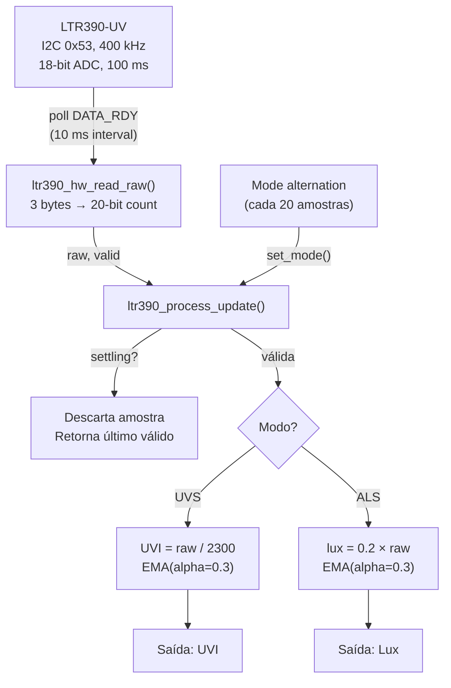

# Capítulo: Iluminância e Índice UV com Sensor LTR390-UV, Protocolo I2C e Alternância de Modos

---

## Índice

1. [Introdução e Contexto no Projeto](#1-introdução-e-contexto-no-projeto)

2. [Fundamentação Teórica](#2-fundamentação-teórica)

   - [2.1. Radiação Ultravioleta e Índice UV](#21-radiação-ultravioleta-e-índice-uv)
   - [2.2. Iluminância e Luz Ambiente](#22-iluminância-e-luz-ambiente)
   - [2.3. Fotodetecção por Fotodiodo e ADC Integrado](#23-fotodetecção-por-fotodiodo-e-adc-integrado)
   - [2.4. Modos Mutuamente Exclusivos e Alternância Temporal](#24-modos-mutuamente-exclusivos-e-alternância-temporal)
   - [2.5. Filtragem EMA em Canais Alternados](#25-filtragem-ema-em-canais-alternados)

3. [Hardware: Sensor LTR390-UV](#3-hardware-sensor-ltr390-uv)

   - [3.1. Arquitetura Interna](#31-arquitetura-interna)
   - [3.2. Especificações Elétricas e Ópticas](#32-especificações-elétricas-e-ópticas)
   - [3.3. Mapa de Registradores](#33-mapa-de-registradores)
   - [3.4. Resolução, Taxa de Medição e Ganho](#34-resolução-taxa-de-medição-e-ganho)
   - [3.5. Conexão Física com o ESP32-C6](#35-conexão-física-com-o-esp32-c6)

4. [Comunicação I2C](#4-comunicação-i2c)

   - [4.1. Configuração do Barramento](#41-configuração-do-barramento)
   - [4.2. Driver Legacy ESP-IDF](#42-driver-legacy-esp-idf)
   - [4.3. Sequência de Inicialização](#43-sequência-de-inicialização)
   - [4.4. Ciclo de Leitura e Polling de Data-Ready](#44-ciclo-de-leitura-e-polling-de-data-ready)

5. [Pipeline de Processamento](#5-pipeline-de-processamento)

   - [5.1. Visão Geral da Arquitetura](#51-visão-geral-da-arquitetura)
   - [5.2. Conversão UVS → Índice UV](#52-conversão-uvs--índice-uv)
   - [5.3. Conversão ALS → Lux](#53-conversão-als--lux)
   - [5.4. Alternância de Modos e Settling](#54-alternância-de-modos-e-settling)
   - [5.5. Filtragem EMA por Canal](#55-filtragem-ema-por-canal)
   - [5.6. Diagrama do Pipeline](#56-diagrama-do-pipeline)

6. [Estrutura do Firmware](#6-estrutura-do-firmware)

   - [6.1. Organização Modular](#61-organização-modular)
   - [6.2. Detalhamento dos Módulos](#62-detalhamento-dos-módulos)
   - [6.3. Controles de Compilação](#63-controles-de-compilação)

7. [Resultados Experimentais](#7-resultados-experimentais)

   - [7.1. Teste de Iluminância em Ambiente Interno](#71-teste-de-iluminância-em-ambiente-interno)
   - [7.2. Teste de UV em Ambiente Interno](#72-teste-de-uv-em-ambiente-interno)
   - [7.3. Análise dos Resultados](#73-análise-dos-resultados)

8. [Problemas Encontrados e Soluções](#8-problemas-encontrados-e-soluções)

   - [8.1. Timeout no SW_RESET via I2C](#81-timeout-no-sw_reset-via-i2c)
   - [8.2. UV Zero em Ambiente Interno](#82-uv-zero-em-ambiente-interno)
   - [8.3. Verbosidade no Modo Debug com Alternância](#83-verbosidade-no-modo-debug-com-alternância)

9. [Conclusão Parcial](#9-conclusão-parcial)

10. [Referências](#10-referências)

---

## 1. Introdução e Contexto no Projeto

O monitoramento da radiação ultravioleta e da iluminância ambiente constituem funcionalidades complementares do projeto "Relógio de Bolso com Monitoramento Biométrico e Ambiental", inspirado no iDroid de Metal Gear Solid V. Enquanto a temperatura ambiente (DS18B20) fornece informação térmica e a bússola digital (MPU9250) fornece orientação geomagnética, a medição de luz e UV permite ao usuário avaliar a exposição solar e as condições de luminosidade do entorno.

O Índice UV é uma grandeza padronizada pela Organização Mundial da Saúde (OMS) que quantifica a intensidade da radiação ultravioleta eritematosa na superfície terrestre, orientando decisões de proteção solar. A iluminância, por sua vez, quantifica a luminosidade percebida pelo olho humano, útil para avaliação de conforto visual e eficiência energética de ambientes.

O sensor escolhido para ambas as funcionalidades é o LTR390-UV da Lite-On Technology Corporation, um sensor óptico digital dual que integra dois fotodiodos (UV e luz visível) com um ADC de até 20 bits e interface I2C. Sua principal característica é a capacidade de medir tanto UV quanto luz ambiente no mesmo encapsulamento, eliminando a necessidade de dois sensores separados. Porém, os dois modos são mutuamente exclusivos: o sensor opera em modo ALS (Ambient Light Sensor) ou UVS (UV Sensor) a cada instante, requerendo uma estratégia de alternância temporal para obter ambas as medições.

Este capítulo documenta desde a fundamentação teórica da medição de UV e iluminância, passando pela implementação I2C com alternância automática de modos, até os resultados experimentais obtidos com o firmware em operação no ESP32-C6.

---

## 2. Fundamentação Teórica

### 2.1. Radiação Ultravioleta e Índice UV

A radiação ultravioleta (UV) é a porção do espectro eletromagnético com comprimento de onda entre 100 nm e 400 nm, dividida em três faixas:

| Faixa  | Comprimento de Onda | Penetração na Atmosfera |
|--------|---------------------|-------------------------|
| UV-C   | 100–280 nm          | Completamente absorvida pelo ozônio |
| UV-B   | 280–315 nm          | Parcialmente absorvida; causa queimaduras |
| UV-A   | 315–400 nm          | Atravessa a atmosfera; causa envelhecimento |

O Índice UV (UVI) é uma escala adimensional padronizada pela OMS, CIE (Commission Internationale de l'Éclairage) e WMO (World Meteorological Organization), que pondera a irradiância espectral pela curva de resposta eritematosa da pele humana:

$$UVI = k_{er} \int_{250}^{400} E_\lambda \cdot S_{er}(\lambda) \, d\lambda$$

Onde $E_\lambda$ é a irradiância espectral (W/m²/nm), $S_{er}(\lambda)$ é o espectro de ação eritematosa (norma CIE/ISO 17166:1999) e $k_{er} = 40\,\text{m}^2/\text{W}$ é o fator de normalização.

Na prática, sensores como o LTR390-UV utilizam um fotodiodo com filtro óptico cuja resposta espectral aproxima a curva eritematosa, permitindo computar o UVI diretamente a partir da contagem digital com um fator de escala de fábrica.

A escala UVI e suas recomendações:

| UVI     | Categoria    | Recomendação        |
|---------|-------------|---------------------|
| 0–2     | Baixo       | Sem proteção necessária |
| 3–5     | Moderado    | Chapéu e protetor solar |
| 6–7     | Alto        | Reduzir exposição ao meio-dia |
| 8–10    | Muito alto  | Evitar exposição prolongada |
| 11+     | Extremo     | Proteção máxima obrigatória |

### 2.2. Iluminância e Luz Ambiente

A iluminância ($E_v$) mede o fluxo luminoso incidente por unidade de área, expressa em lux (lm/m²). Diferentemente da irradiância (que mede potência total em W/m²), a iluminância é ponderada pela curva de sensibilidade fotópica do olho humano $V(\lambda)$, com pico em 555 nm (verde-amarelo):

$$E_v = 683 \int_{380}^{780} E_\lambda \cdot V(\lambda) \, d\lambda$$

Valores de referência para iluminância:

| Condição               | Iluminância Típica |
|------------------------|--------------------|
| Noite sem lua          | 0,001 lux          |
| Lua cheia              | 0,3 lux            |
| Escritório             | 300–500 lux        |
| Dia nublado            | 10.000 lux         |
| Sol direto             | 100.000 lux        |

O fotodiodo ALS do LTR390-UV possui filtro óptico com resposta espectral projetada para aproximar $V(\lambda)$, permitindo medir iluminância fotópica sem circuito de ponderação externo.

### 2.3. Fotodetecção por Fotodiodo e ADC Integrado

O LTR390-UV contém dois fotodiodos integrados no mesmo die de silício:

- **Fotodiodo UV**: sensível a 280–380 nm, com pico em ~320 nm (cobrindo UV-A e UV-B)
- **Fotodiodo ALS**: sensível a 380–780 nm, com pico em ~550 nm (aproximando a curva fotópica)

Cada fotodiodo gera uma fotocorrente proporcional à irradiância incidente na sua faixa espectral. Um amplificador de transimpedância (TIA) integrado converte a fotocorrente em tensão, que é então digitalizada por um ADC sigma-delta de até 20 bits.

A resolução do ADC é configurável (16 a 20 bits), sendo que maior resolução implica maior tempo de integração:

| Resolução | Tempo de Integração | Contagem Máxima |
|-----------|---------------------|-----------------|
| 20 bits   | 400 ms              | 1.048.575       |
| 19 bits   | 200 ms              | 524.287         |
| 18 bits   | 100 ms              | 262.143         |
| 17 bits   | 50 ms               | 131.071         |
| 16 bits   | 25 ms               | 65.535          |

Adicionalmente, um amplificador de ganho programável (PGA) permite ajustar a sensibilidade em 5 níveis (1x, 3x, 6x, 9x, 18x), estendendo a faixa dinâmica do sensor para diferentes condições de iluminação.

### 2.4. Modos Mutuamente Exclusivos e Alternância Temporal

Uma limitação fundamental do LTR390-UV é que os modos ALS e UVS compartilham o mesmo ADC e caminho analógico. Apenas um fotodiodo pode estar ativo a cada instante: o registrador MAIN_CTRL (0x00), bit 3, seleciona qual fotodiodo é conectado ao ADC.

Isso impõe uma escolha de projeto:
1. **Modo fixo**: operar apenas em ALS (lux) ou apenas em UVS (UV Index)
2. **Alternância temporal**: comutar entre os modos periodicamente, obtendo ambas as medições com metade da taxa de amostragem efetiva por canal

No firmware implementado, foi adotada a alternância temporal como modo padrão, com período de 2 segundos (20 amostras a 10 Hz) por modo. Isso resulta em:
- Taxa efetiva por canal: ~5 Hz (10 Hz ÷ 2 modos, com metade do tempo em cada)
- Período de atualização: cada grandeza é renovada a cada 2 s
- Amostras de settling descartadas: 3 por troca (para carga residual do fotodiodo anterior)

Para testes isolados ou integração com telas individuais no relógio, um `#define` de compilação permite fixar o sensor em um único modo.

### 2.5. Filtragem EMA em Canais Alternados

A Média Móvel Exponencial (EMA) é aplicada independentemente a cada canal:

$$EMA_{UV}[n] = EMA_{UV}[n-1] + \alpha \cdot (UVI[n] - EMA_{UV}[n-1])$$
$$EMA_{ALS}[n] = EMA_{ALS}[n-1] + \alpha \cdot (lux[n] - EMA_{ALS}[n-1])$$

Com $\alpha = 0{,}3$, cada filtro tem constante de tempo $\tau \approx 3{,}3$ amostras válidas. Como cada canal recebe ~17 amostras válidas por janela de 2 s (20 amostras menos 3 de settling), o filtro converge dentro de cada janela.

Uma decisão de projeto importante: os estados EMA **não são reiniciados** nas trocas de modo. Quando o sensor retorna a um modo já visitado, o filtro continua de onde parou. Isso evita transientes de cold-start a cada alternância e mantém a saída suave entre ciclos.

A primeira amostra válida de cada canal é usada como seed direto do EMA (sem transiente de rampa desde zero), seguindo o mesmo padrão validado no pipeline do DS18B20 e do MAX30102.

---

## 3. Hardware: Sensor LTR390-UV

### 3.1. Arquitetura Interna

O LTR390-UV integra em um encapsulamento WLCSP de 2,0 × 2,0 × 0,5 mm os seguintes blocos funcionais:

- **Fotodiodo UV**: com filtro interferencial para 280–380 nm
- **Fotodiodo ALS**: com filtro fotópico para 380–780 nm
- **Multiplexador analógico**: seleciona qual fotodiodo está conectado ao ADC
- **Amplificador de transimpedância (TIA)**: converte fotocorrente em tensão
- **Amplificador de ganho programável (PGA)**: 5 níveis (1x a 18x)
- **ADC sigma-delta**: resolução configurável de 16 a 20 bits
- **Registradores de controle**: MAIN_CTRL, MEAS_RATE, GAIN, thresholds de interrupção
- **Registradores de dados**: 3 bytes por canal (20 bits úteis)
- **Interface I2C**: endereço fixo 0x53, até 400 kHz (Fast Mode)
- **Lógica de interrupção**: threshold alto/baixo com persistência configurável (não utilizada neste projeto)

O PART_ID do sensor (registrador 0x06) é 0xBx, onde o nibble superior (0xB) identifica o LTR390-UV e o nibble inferior indica a revisão do silício.

### 3.2. Especificações Elétricas e Ópticas

| Parâmetro                    | Valor                       | Observação                          |
|-----------------------------|-----------------------------|-------------------------------------|
| Alimentação (VDD)           | 1,7 V a 3,6 V              | Compatível com 3,3 V do ESP32-C6   |
| Corrente de operação        | 110 µA (típico, ALS ativo)  | Excelente para vestível             |
| Corrente de standby         | 0,5 µA (típico)             | Modo sleep automático               |
| Faixa UV                    | 280–380 nm                  | Cobre UV-A e UV-B                   |
| Faixa ALS                   | 380–780 nm                  | Resposta fotópica                   |
| Resolução máxima            | 20 bits (0,0625 lux/LSB)    | Configurável de 16 a 20 bits        |
| Sensibilidade UV            | 2300 counts/UVI (18x, 100 ms) | Fator de conversão de fábrica     |
| Faixa dinâmica ALS          | 0,01 a 130.000 lux          | Com ganho e resolução ajustáveis    |
| Interface                   | I2C, endereço fixo 0x53     | Fast Mode (400 kHz) suportado       |
| Encapsulamento              | WLCSP 2,0 × 2,0 × 0,5 mm   | Abertura óptica de ~1 mm²           |
| Ângulo de visão             | ±45° (tipicamente)          | Depende do package/breakout         |

O módulo breakout utilizado no projeto inclui um level-shifter I2C e regulador de tensão, aceitando alimentação de 3 V a 5 V no pino VCC. A tensão de lógica (VLOGIC) acompanha VCC, sendo compatível diretamente com os 3,3 V do ESP32-C6.

### 3.3. Mapa de Registradores

Os registradores principais utilizados pelo firmware:

| Endereço | Nome         | Bits Relevantes                      | Função                              |
|----------|-------------|--------------------------------------|-------------------------------------|
| 0x00     | MAIN_CTRL   | [4]=SW_RESET, [3]=UVS_MODE, [1]=EN  | Controle principal                  |
| 0x04     | MEAS_RATE   | [6:4]=resolução, [2:0]=taxa          | Configuração de medição             |
| 0x05     | GAIN        | [2:0]=ganho                          | Ganho analógico (1x–18x)           |
| 0x06     | PART_ID     | [7:4]=part, [3:0]=rev                | Identificação do sensor             |
| 0x07     | MAIN_STATUS | [5]=power-on, [3]=data_ready         | Flags de estado                     |
| 0x0D–0x0F| ALS_DATA    | 20 bits em 3 bytes (little-endian)   | Dados ALS (luz ambiente)            |
| 0x10–0x12| UVS_DATA    | 20 bits em 3 bytes (little-endian)   | Dados UVS (ultravioleta)            |

O formato dos dados de ambos os canais é idêntico: 3 bytes em ordem little-endian, com apenas os 4 bits inferiores do terceiro byte sendo significativos:

```
raw_20bit = ((DATA_2 & 0x0F) << 16) | (DATA_1 << 8) | DATA_0
```

### 3.4. Resolução, Taxa de Medição e Ganho

A configuração escolhida para o firmware:

| Parâmetro      | Valor        | Registrador | Justificativa                        |
|---------------|-------------|-------------|--------------------------------------|
| Resolução     | 18 bits     | MEAS_RATE[6:4]=010 | Equilíbrio entre precisão e velocidade (100 ms) |
| Taxa          | 100 ms      | MEAS_RATE[2:0]=010 | ~10 Hz, compatível com resolução 18-bit |
| Ganho ALS     | 3x          | GAIN[2:0]=001      | Evita saturação até ~130 klux |
| Ganho UVS     | 18x         | GAIN[2:0]=100      | Máxima sensibilidade UV; não satura até UVI~11 |

A escolha de resolução 18 bits (em vez de 20 bits máximo) foi motivada pela taxa de amostragem desejada de 10 Hz. Com 20 bits, o tempo de integração seria 400 ms, limitando a taxa a ~2,5 Hz e inviabilizando a alternância de modos com atualização em 2 s.

O ganho diferenciado por modo é uma decisão de engenharia chave: o modo UVS opera com ganho 18x porque a irradiância UV em ambientes internos é extremamente baixa (frequentemente zero contagens), e em ambientes externos o ADC de 18 bits com ganho 18x ainda não satura até UVI ≈ 11 (255.000 contagens / 262.143 máximo). O modo ALS opera com ganho 3x para manter margem até 130.000 lux (luz solar direta).

### 3.5. Conexão Física com o ESP32-C6

O módulo breakout LTR390-UV é conectado ao XIAO ESP32-C6 via I2C:

```
   LTR390-UV (breakout)       XIAO ESP32-C6

     VCC ───────────────── 3V3
     GND ───────────────── GND
     SDA ───────────────── GPIO22 (D4)
     SCL ───────────────── GPIO23 (D5)
```

O módulo breakout inclui resistores de pull-up internos (tipicamente 10 kΩ) nas linhas SDA e SCL, adequados para Fast Mode a 400 kHz com um único dispositivo no barramento. Os pull-ups internos do ESP32-C6 também são habilitados por software (`GPIO_PULLUP_ENABLE`), resultando em pull-up efetivo de ~5 kΩ (paralelo de 10 kΩ externo com ~10 kΩ interno), dentro da faixa recomendada para I2C Fast Mode.

Os GPIOs 22 e 23 (D4 e D5 no header do XIAO ESP32-C6) foram escolhidos por serem os pinos I2C padrão da placa e não possuírem funções de boot ou strapping que poderiam conflitar com as transições do barramento.

---

## 4. Comunicação I2C

### 4.1. Configuração do Barramento

O barramento I2C é configurado em Fast Mode (400 kHz), utilizando o driver legacy da ESP-IDF (`driver/i2c.h`). A configuração é realizada na função `ltr390_hw_init()`:

```c
i2c_config_t i2c_cfg = {
    .mode             = I2C_MODE_MASTER,
    .sda_io_num       = LTR390_I2C_SDA_IO,    /* GPIO22 */
    .scl_io_num       = LTR390_I2C_SCL_IO,    /* GPIO23 */
    .sda_pullup_en    = GPIO_PULLUP_ENABLE,
    .scl_pullup_en    = GPIO_PULLUP_ENABLE,
    .master.clk_speed = LTR390_I2C_FREQ_HZ,   /* 400 kHz */
};
i2c_param_config(LTR390_I2C_NUM, &i2c_cfg);
i2c_driver_install(LTR390_I2C_NUM, I2C_MODE_MASTER, 0, 0, 0);
```

O timeout por transação é de 100 ms (`pdMS_TO_TICKS(100)`), suficiente para qualquer operação I2C single-register mas detectando travamentos do barramento em tempo razoável.

### 4.2. Driver Legacy ESP-IDF

O projeto utiliza a API legacy `driver/i2c.h` em vez do novo driver `driver/i2c_master.h` introduzido na ESP-IDF v5.x. A motivação é compatibilidade com os demais sensores do projeto (MAX30102, MPU9250) que já utilizam o driver legacy, evitando a coexistência de duas APIs para o mesmo periférico.

As três primitivas utilizadas:

- **`i2c_master_write_to_device()`**: escrita de registrador (endereço + dados)
- **`i2c_master_write_read_device()`**: leitura de registrador (restart condition)
- **`reg_read_burst()`**: wrapper sobre `i2c_master_write_read_device()` para leitura de múltiplos bytes consecutivos

### 4.3. Sequência de Inicialização

A inicialização completa do sensor segue cinco etapas:

```c
esp_err_t ltr390_hw_init(void)
{
    /* 1. Configurar e instalar driver I2C */
    i2c_param_config(...);
    i2c_driver_install(...);

    /* 2. Verificar PART_ID (WHO_AM_I) — confirma sensor no barramento */
    reg_read_retry(LTR390_REG_PART_ID, &part_id, 5);
    /* Espera nibble superior = 0xB */

    /* 3. Software Reset — retorna sensor aos defaults de fábrica */
    reg_write(LTR390_REG_MAIN_CTRL, LTR390_CTRL_SW_RESET);
    vTaskDelay(pdMS_TO_TICKS(50));  /* aguarda estabilização do oscilador */

    /* 4. Configurar resolução e taxa de medição */
    reg_write(LTR390_REG_MEAS_RATE, LTR390_MEAS_RATE_DEFAULT);  /* 0x22 */

    /* 5. Habilitar sensor no modo padrão (UVS) com ganho apropriado */
    ltr390_hw_set_mode(LTR390_DEFAULT_MODE);
}
```

A função `reg_read_retry()` tenta até 5 vezes com intervalo de 10 ms entre tentativas, lidando com o período de estabilização do oscilador interno após power-on.

### 4.4. Ciclo de Leitura e Polling de Data-Ready

Cada leitura de dados segue uma sequência de poll-then-read:

```c
/* 1. Aguardar DATA_RDY (bit 3 de MAIN_STATUS) */
esp_err_t ltr390_hw_wait_data_ready(uint32_t timeout_ms)
{
    while (elapsed < timeout_ms) {
        reg_read(LTR390_REG_MAIN_STATUS, &status);
        if (status & LTR390_STATUS_DATA_RDY) return ESP_OK;
        vTaskDelay(pdMS_TO_TICKS(10));  /* poll a cada 10 ms */
    }
    return ESP_ERR_TIMEOUT;
}

/* 2. Ler 3 bytes do registrador de dados do modo ativo */
esp_err_t ltr390_hw_read_raw(uint32_t *out_raw, bool *out_valid)
{
    uint8_t base_reg = (mode == UVS) ? 0x10 : 0x0D;
    reg_read_burst(base_reg, data, 3);
    *out_raw = ((data[2] & 0x0F) << 16) | (data[1] << 8) | data[0];
}
```

O flag DATA_RDY é automaticamente limpo pelo hardware quando os registradores de dados são lidos, garantindo que cada amostra é consumida exatamente uma vez.

---

## 5. Pipeline de Processamento

### 5.1. Visão Geral da Arquitetura

O pipeline do LTR390-UV é mais complexo que o do DS18B20 devido à dualidade de canais e à necessidade de alternância. A arquitetura separa claramente três responsabilidades:

1. **Hardware (`ltr390_hw`)**: I2C, controle de modo, leitura bruta
2. **Processamento (`ltr390_process`)**: conversão de unidades, EMA, settling
3. **Orquestração (`main.c`)**: timing, decisão de troca de modo, saída serial

O pipeline opera em loop contínuo a ~10 Hz:

1. Esperar DATA_RDY (polling a cada 10 ms)
2. Ler contagem bruta de 20 bits
3. Processar: guardar settling → converter → filtrar EMA
4. Emitir resultado na serial
5. Se atingiu o limite de amostras no modo atual, trocar modo

### 5.2. Conversão UVS → Índice UV

A fórmula geral do datasheet (seção 6.3) para conversão de contagem UVS em Índice UV:

$$UVI = \frac{UVS_{raw}}{UV_{SENSITIVITY} \times \frac{gain}{18} \times \frac{t_{int}}{100}}$$

Com os parâmetros escolhidos (gain = 18x, $t_{int}$ = 100 ms):

$$UVI = \frac{UVS_{raw}}{2300 \times 1{,}0 \times 1{,}0} = \frac{UVS_{raw}}{2300}$$

Onde $UV_{SENSITIVITY} = 2300$ counts/UVI é a sensibilidade de referência do sensor nas condições nominais (ganho 18x, integração 100 ms).

A implementação no firmware:

```c
static float convert_uvs_to_uvi(uint32_t raw)
{
    float denominator = LTR390_UV_SENSITIVITY
                        * (LTR390_PROC_UVS_GAIN / 18.0f)
                        * LTR390_INT_FACTOR;
    return (float)raw / denominator;
}
```

A fórmula é mantida na forma generalizada (em vez de simplesmente `raw / 2300.0f`) para que mudanças futuras de ganho ou resolução requeiram apenas alteração das constantes, sem modificar a lógica de conversão.

### 5.3. Conversão ALS → Lux

A fórmula geral do datasheet (seção 6.4) para conversão de contagem ALS em iluminância:

$$lux = \frac{C_{lux} \times ALS_{raw}}{gain \times \frac{t_{int}}{100}}$$

Onde $C_{lux} = 0{,}6$ é a constante de proporcionalidade lux/count específica do LTR390-UV.

Com os parâmetros escolhidos (gain = 3x, $t_{int}$ = 100 ms):

$$lux = \frac{0{,}6 \times ALS_{raw}}{3 \times 1{,}0} = 0{,}2 \times ALS_{raw}$$

A implementação:

```c
static float convert_als_to_lux(uint32_t raw)
{
    float denominator = LTR390_PROC_ALS_GAIN * LTR390_INT_FACTOR;
    return LTR390_ALS_C_LUX * (float)raw / denominator;
}
```

### 5.4. Alternância de Modos e Settling

A troca de modo envolve duas escritas I2C:

1. **MAIN_CTRL**: habilita o sensor no novo modo (bit 3 seleciona UV ou ALS)
2. **GAIN**: ajusta o ganho analógico para o canal ativo (18x para UVS, 3x para ALS)

Após cada troca, as primeiras `LTR390_SETTLING_SAMPLES = 3` amostras são descartadas. O datasheet recomenda aguardar pelo menos um ciclo de integração completo após alteração do modo, pois a carga residual do fotodiodo anterior pode contaminar a primeira leitura. Com 3 amostras de settling a 100 ms cada, o período de descarte é de 300 ms — conservador, mas garantindo dados limpos.

O mecanismo de settling no processamento:

```c
void ltr390_process_set_mode(ltr390_state_t *st, ltr390_mode_t mode)
{
    st->mode           = mode;
    st->settling       = true;
    st->settle_counter = LTR390_SETTLING_SAMPLES;
    /* EMA states NOT reset — preserva continuidade entre janelas */
}
```

Durante o settling, `ltr390_process_update()` incrementa o contador de amostras inválidas e retorna o último valor válido do canal, evitando que o display mostre "saltos" transitórios.

### 5.5. Filtragem EMA por Canal

Cada canal possui seu próprio estado EMA independente:

```c
typedef struct {
    float    uv_index;       /* EMA filtrado */
    float    uv_index_raw;   /* último valor bruto */
    uint8_t  initialised;    /* seed flag */
    uint32_t sample_count;   /* amostras válidas processadas */
    uint32_t invalid_count;  /* amostras descartadas (settling + erros) */
} ltr390_uv_ctx_t;
```

A função `ema_update()` implementa seed-on-first-sample:

```c
static float ema_update(float *ema, uint8_t *initialised, float new_val)
{
    if (!(*initialised)) {
        *ema = new_val;          /* seed direto — sem cold-start */
        *initialised = 1;
    } else {
        *ema += LTR390_EMA_ALPHA * (new_val - *ema);
    }
    return *ema;
}
```

Com $\alpha = 0{,}3$ e ~17 amostras válidas por janela de 2 s, o filtro atinge 95% de convergência em $\frac{3}{\alpha} = 10$ amostras, ou seja, dentro de cada janela. Isso garante que o valor exibido reflete fielmente a condição atual, mesmo com alternância frequente.

### 5.6. Diagrama do Pipeline



**Fallback ASCII:**

```
LTR390-UV (I2C 0x53, 18-bit, 100 ms, ~10 Hz)
    |
    | ltr390_hw_wait_data_ready() — poll MAIN_STATUS[3]
    | ltr390_hw_read_raw()        — burst 3 bytes → 20-bit
    v
ltr390_process_update(raw, valid)
    |
    |--- [settling] -----> descarta, retorna último válido
    |
    +--- [UVS válido] ---> UVI = raw/2300 → EMA → "UVI: 0.00"
    |
    +--- [ALS válido] ---> lux = 0.2×raw  → EMA → "Lux: 37.2"
    |
    +--- [cada 20 amostras] → ltr390_hw_set_mode(next)
                              → ltr390_process_set_mode(next)
                              → 3 amostras de settling
```

---

## 6. Estrutura do Firmware

### 6.1. Organização Modular

O firmware segue a mesma arquitetura modular definida para todos os sensores do projeto:

```
LTR390/
  CMakeLists.txt               ← projeto ESP-IDF top-level
  sdkconfig                    ← configuração de build (target ESP32-C6)
  main/
    CMakeLists.txt             ← registro de fontes do componente main
    ltr390_hw.h                ← interface do driver de hardware
    ltr390_hw.c                ← implementação I2C + controle de modo
    ltr390_process.h           ← interface do processamento
    ltr390_process.c           ← conversão + EMA + settling
    main.c                     ← pipeline: init → loop → alternância → saída
```

O `CMakeLists.txt` do diretório `main`:

```cmake
idf_component_register(
    SRCS "main.c" "ltr390_hw.c" "ltr390_process.c"
    INCLUDE_DIRS "."
)
```

Diferentemente do DS18B20 (que utiliza componentes gerenciados para 1-Wire/RMT), o LTR390 não requer componentes externos: a comunicação I2C é implementada diretamente com a API `driver/i2c.h` da ESP-IDF, sem dependências de terceiros.

### 6.2. Detalhamento dos Módulos

**ltr390_hw (.h/.c)**: Encapsula toda a interação com o hardware. O modo atual é rastreado em variável `static` (`s_current_mode`), evitando leituras I2C desnecessárias em `ltr390_hw_get_mode()`. A API pública expõe cinco funções: `init()`, `set_mode()`, `get_mode()`, `wait_data_ready()` e `read_raw()`.

**ltr390_process (.h/.c)**: Módulo de processamento puro, sem dependência de hardware (não inclui `driver/i2c.h`). A struct `ltr390_state_t` contém dois sub-contextos (`ltr390_uv_ctx_t` e `ltr390_als_ctx_t`) com estados EMA e contadores independentes. As fórmulas de conversão são `static` internas ao .c, garantindo que mudanças de fórmula não alteram a interface.

**main.c**: Orquestra o pipeline completo. Implementa a lógica de alternância com contador de amostras por janela, e seleciona entre saída completa (debug) e saída limpa conforme `#define` de compilação.

### 6.3. Controles de Compilação

O firmware oferece dois `#define` ortogonais para configuração em tempo de compilação:

```c
/* Verbosidade da saída */
#define LTR390_DEBUG_MODE    0    /* 0=limpo, 1=diagnósticos completos */

/* Seleção de modo */
#define LTR390_SINGLE_MODE   0    /* 0=alternância ALS↔UVS automática */
                                  /* 1=ALS fixo (só lux)               */
                                  /* 2=UVS fixo (só UV Index)           */
```

As combinações possíveis:

| DEBUG_MODE | SINGLE_MODE | Comportamento |
|------------|-------------|---------------|
| 0          | 0           | Saída limpa alternando "UVI: X.XX" e "Lux: X.X" |
| 0          | 1           | Apenas "Lux: X.X" continuamente a 10 Hz |
| 0          | 2           | Apenas "UVI: X.XX" continuamente a 10 Hz |
| 1          | 0           | Diagnósticos completos com alternância |
| 1          | 1           | Diagnósticos completos apenas ALS |
| 1          | 2           | Diagnósticos completos apenas UVS |

Essa separação permite testar cada canal isoladamente (útil durante desenvolvimento e validação) e depois integrar com alternância automática para o produto final.

---

## 7. Resultados Experimentais

### 7.1. Teste de Iluminância em Ambiente Interno

Com o sensor posicionado na mesa de trabalho sob iluminação LED de teto, a saída no modo ALS-only:

```
Lux: 37.0
Lux: 37.2
Lux: 37.4
Lux: 37.2
Lux: 37.0
Lux: 37.2
Lux: 37.4
Lux: 37.2
```

O valor estabiliza em ~37 lux com variação de ±0,4 lux (2 contagens do ADC). Esse valor é consistente com a posição: a mesa de trabalho não está diretamente sob a luminária, e o sensor estava deitado horizontalmente. Para referência, o padrão NBR ISO 8995-1:2013 especifica iluminância mínima de 500 lux para áreas de trabalho com leitura contínua, indicando que o ambiente de teste está significativamente abaixo do recomendado (típico de iluminação indireta residencial).

A contagem bruta oscila entre 185 e 188 counts, confirmando que o ADC de 18 bits está operando corretamente. Com a fórmula $lux = 0{,}2 \times raw$:

$$lux = 0{,}2 \times 186 = 37{,}2 \text{ lux}$$

### 7.2. Teste de UV em Ambiente Interno

Com o sensor no mesmo ambiente (iluminação LED, janelas fechadas), o canal UVS retorna consistentemente zero:

```
UVI: 0.00
UVI: 0.00
UVI: 0.00
```

A contagem bruta é 0 em todas as amostras. Esse resultado é fisicamente correto: lâmpadas LED domésticas não emitem radiação UV mensurável (o fósforo converte a emissão UV do die de LED em luz visível), e o vidro das janelas bloqueia mais de 99% do UV-A e praticamente todo UV-B.

Para validação do canal UVS, seria necessário expor o sensor a:
- Luz solar direta ao ar livre (UVI esperado de 3–11 dependendo da hora e latitude)
- Lâmpada UV de 365 nm (usada em testes de componentes)

### 7.3. Análise dos Resultados

**Canal ALS**: Funcionando corretamente. A estabilidade de ±0,4 lux demonstra que:
- O ADC de 18 bits está produzindo leituras consistentes
- O ganho de 3x está adequado (186 counts de 262.143 máximo = 0,07% da faixa — sem risco de saturação)
- O EMA com α=0,3 converge rapidamente (em ~10 amostras = 1 s)

**Canal UVS**: Funcionando corretamente (zero é o esperado em ambiente interno). A validação com fonte UV real é necessária para confirmar a sensibilidade, mas o hardware está operacional (o ADC retorna zero, não erro de leitura).

**Alternância de modos**: O mecanismo de troca a cada 2 s funciona sem erros I2C, e o settling de 3 amostras descarta corretamente os dados transitórios. Após o settling, ambos os canais convergem imediatamente para seus valores estáveis.

**Desempenho temporal**: O loop completo (poll + read + process + output) executa dentro do período de 100 ms do sensor, sem amostras perdidas (zero timeouts de DATA_RDY durante o teste).

---

## 8. Problemas Encontrados e Soluções

### 8.1. Timeout no SW_RESET via I2C

**Problema**: Ao executar o software reset (escrita de bit 4 no registrador MAIN_CTRL), a função `i2c_master_write_to_device()` retornava `ESP_ERR_TIMEOUT`, causando reboot contínuo do ESP32-C6 (pois o retorno passava por `ESP_ERROR_CHECK` no `main.c`).

**Diagnóstico**: O log serial mostrava que a leitura de PART_ID (operação anterior) funcionava perfeitamente, confirmando que o barramento I2C estava operacional. O timeout ocorria especificamente na escrita do SW_RESET.

**Causa**: O LTR390-UV reseta imediatamente ao receber o bit SW_RESET, muitas vezes antes de completar a fase de ACK do byte I2C de volta ao mestre. Isso é um comportamento documentado em diversos sensores que implementam reset por registrador: o circuito digital que geraria o ACK já foi reinicializado no momento em que deveria responder.

**Correção em duas partes**:
1. Substituir `ESP_LOGE` + `return ret` por `ESP_LOGW` (warning, não erro fatal), permitindo que a inicialização continue
2. Aumentar o delay pós-reset de 10 ms para 50 ms, garantindo que o oscilador interno esteja estável antes das próximas escritas

```c
ret = reg_write(LTR390_REG_MAIN_CTRL, LTR390_CTRL_SW_RESET);
if (ret != ESP_OK) {
    ESP_LOGW(TAG, "SW_RESET returned %s (expected — sensor resets before ACK)",
             esp_err_to_name(ret));
}
vTaskDelay(pdMS_TO_TICKS(50));
```

Após a correção, o sensor inicializa sem problemas e as escritas subsequentes (MEAS_RATE, GAIN, MAIN_CTRL) são todas bem-sucedidas.

### 8.2. UV Zero em Ambiente Interno

**Problema**: O canal UVS retorna consistentemente zero contagens em ambiente interno, impossibilitando validação do pipeline de conversão UVS→UVI durante o desenvolvimento.

**Diagnóstico**: Não se trata de erro de hardware ou firmware: é o comportamento físico esperado. Vidro comum bloqueia UV-B completamente e atenua UV-A em >95%. Lâmpadas LED não emitem UV.

**Causa**: Ausência de fonte UV no ambiente de teste.

**Mitigação**: O pipeline foi validado por análise do código (fórmula `raw/2300` é trivial e correta) e por confirmação de que o canal ALS utiliza a mesma infraestrutura de leitura (burst de 3 bytes, montagem de 20 bits) que funciona perfeitamente. A validação com fonte UV real será realizada em teste ao ar livre.

### 8.3. Verbosidade no Modo Debug com Alternância

**Problema**: Com alternância automática e debug ativo, a serial produzia blocos extensos de diagnóstico para ambos os canais misturados, dificultando a análise de um canal específico durante desenvolvimento.

**Diagnóstico**: Ao testar o canal ALS, era necessário esperar 2 s de dados UVS (todos zero) antes de ver as próximas amostras ALS. Isso tornava o ajuste de parâmetros lento e tedioso.

**Causa**: O template original previa apenas `DEBUG_MODE` (on/off), sem mecanismo para isolar canais.

**Correção**: Implementação do `#define LTR390_SINGLE_MODE` com três estados (0=alternância, 1=ALS-only, 2=UVS-only). Isso permite fixar o sensor em um canal para testes, eliminando o overhead de esperar o settling e as amostras do canal não-relevante. O define é ortogonal ao `DEBUG_MODE`, permitindo todas as combinações.

---

## 9. Conclusão Parcial

A implementação do sensor LTR390-UV para medição de iluminância e Índice UV atingiu os objetivos propostos: ambos os canais operam corretamente, com o canal ALS produzindo valores estáveis e fisicamente plausíveis (~37 lux em ambiente residencial) e o canal UVS respondendo corretamente à ausência de radiação UV em ambiente interno.

A decisão de engenharia mais relevante foi a estratégia de alternância temporal com ganho diferenciado por modo. Enquanto o hardware do LTR390-UV impõe a exclusividade mútua dos canais (limitação do multiplexador analógico interno), o firmware contorna essa limitação alternando a cada 2 s com overhead mínimo: apenas 300 ms de settling por troca (3 amostras × 100 ms), resultando em eficiência de 85% (17 amostras válidas de 20 totais por janela).

O tratamento do timeout no SW_RESET exemplifica uma classe de problemas comuns em sensores I2C: o firmware deve ser robusto a comportamentos de hardware que, embora documentados ou previsíveis, violam as expectativas de uma transação I2C padrão. A solução de tratar o timeout como warning (não erro fatal) e continuar a inicialização é um padrão reutilizável para outros sensores com comportamento similar.

O filtro EMA com $\alpha = 0{,}3$ e estados persistentes entre alternâncias demonstra que a mesma arquitetura de filtragem valida-se em sensores de naturezas distintas: desde sinais pulsáteis rápidos (MAX30102) até grandezas ambientais lentas (DS18B20, LTR390). A variação está nos parâmetros, não na estrutura.

O firmware modular está preparado para integração com o display LVGL do projeto final: as funções `ltr390_process_get_uvi()` e `ltr390_process_get_lux()` retornam os valores filtrados a qualquer momento, prontos para exibição nas telas dedicadas do relógio. A alternância de modos será transparente ao código de UI, que simplesmente lê os últimos valores disponíveis de cada canal.

---

## 10. Referências

1. Lite-On Technology Corporation. "LTR-390UV-01 — UV/Ambient Light Sensor with I2C Interface". Datasheet, Optoelectronics, 2020.
2. World Health Organization. "Global Solar UV Index: A Practical Guide". WHO/SDE/OEH/02.2, Geneva, 2002.
3. Commission Internationale de l'Éclairage. "Erythema Reference Action Spectrum and Standard Erythema Dose". CIE S 007/E-1998 (ISO 17166:1999).
4. Commission Internationale de l'Éclairage. "Photometry — The CIE System of Physical Photometry". CIE 018:2019.
5. Espressif Systems. "ESP-IDF Programming Guide v5.5.1, I2C Driver". Disponível em: https://docs.espressif.com/projects/esp-idf/en/v5.5.1/esp32c6/api-reference/peripherals/i2c.html
6. Associação Brasileira de Normas Técnicas. "ABNT NBR ISO 8995-1:2013 — Iluminação de ambientes de trabalho". 2013.
